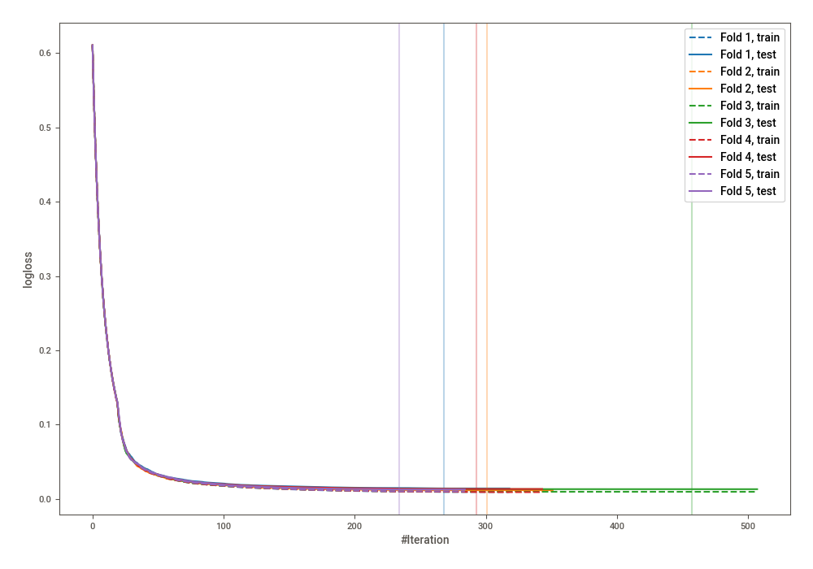
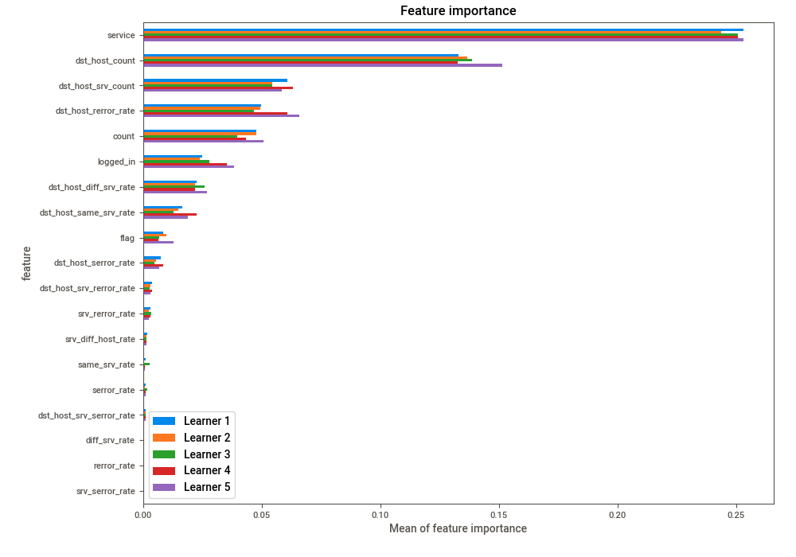
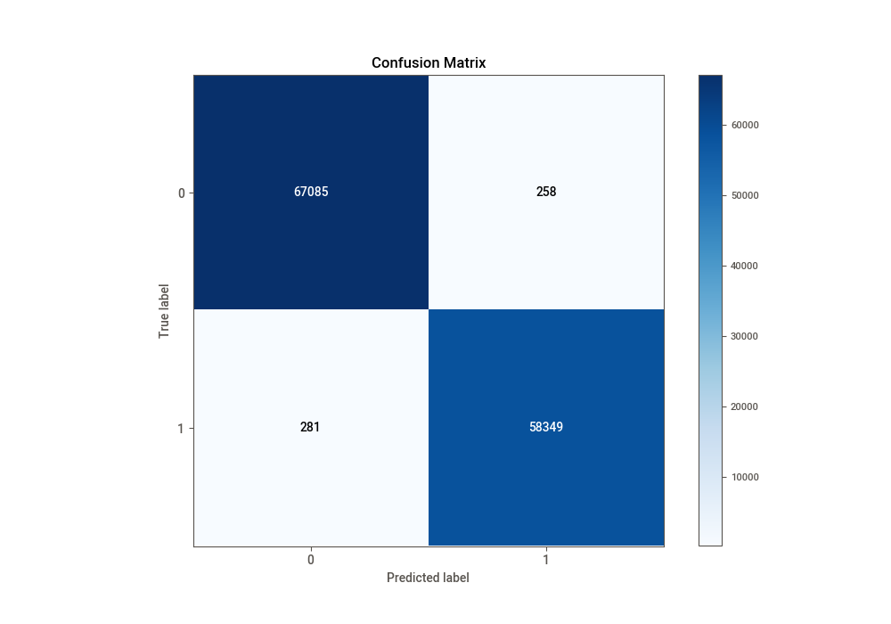
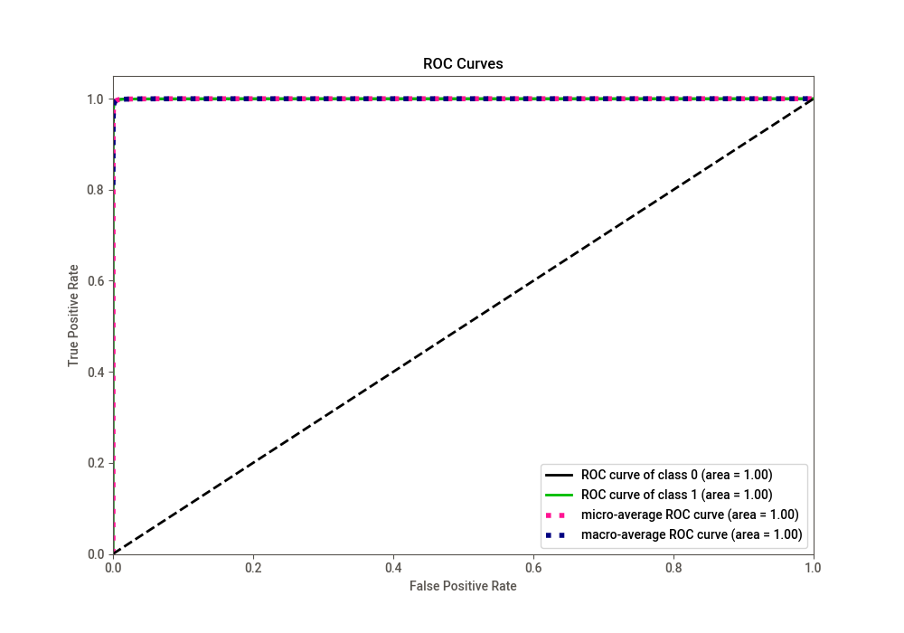
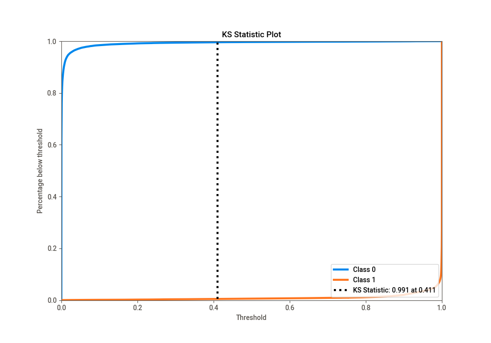
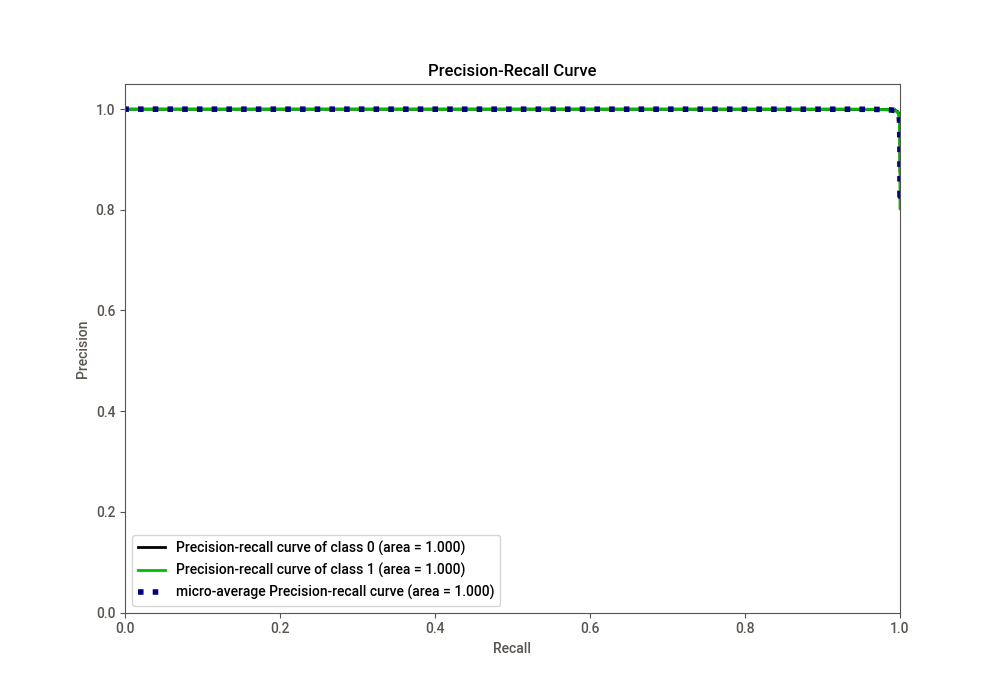
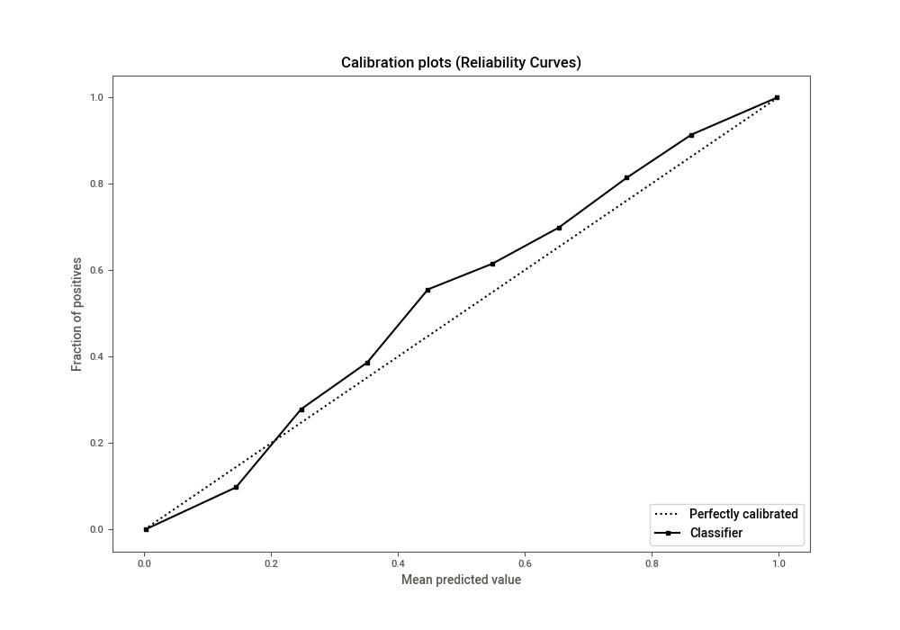
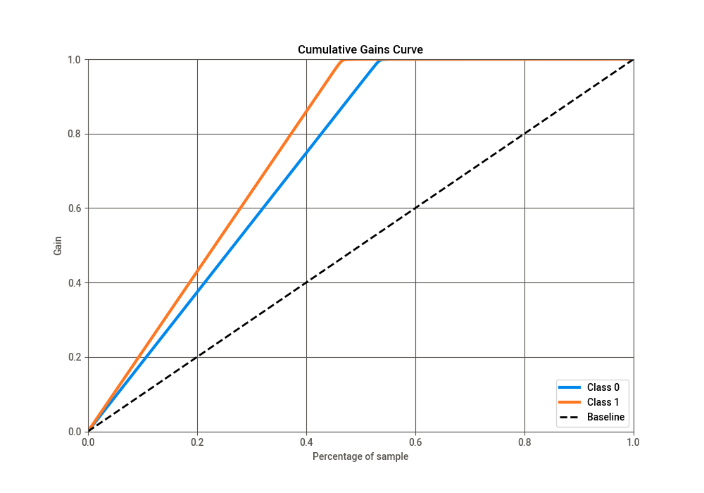
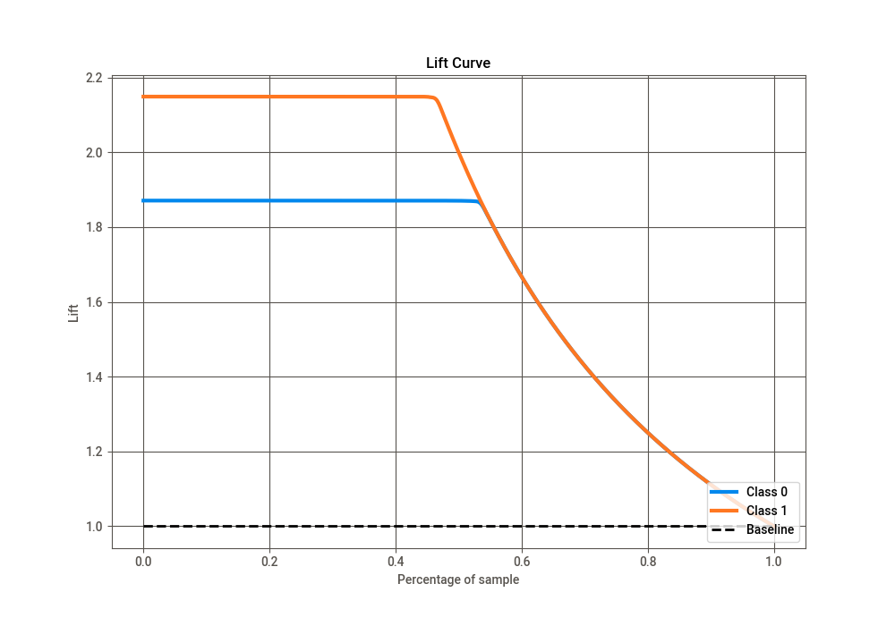

# Summary of 15_CatBoost

[<< Go back](../README.md)

## CatBoost
- **n_jobs**: -1
- **learning_rate**: 0.1
- **depth**: 7
- **rsm**: 1.0
- **loss_function**: Logloss
- **eval_metric**: Logloss
- **explain_level**: 2

## Validation
 - **validation_type**: kfold
 - **k_folds**: 5
 - **shuffle**: True
 - **stratify**: True

## Optimized metric
logloss

## Training time

54.8 seconds

## Metric details
|           |     score |     threshold |
|:----------|----------:|--------------:|
| logloss   | 0.0131537 | nan           |
| auc       | 0.999881  | nan           |
| f1        | 0.995402  |   0.436182    |
| accuracy  | 0.995721  |   0.436182    |
| precision | 1         |   0.999486    |
| recall    | 1         |   2.44598e-08 |
| mcc       | 0.991401  |   0.436182    |

## Confusion matrix (at threshold=0.436182)
|              |   Predicted as 0 |   Predicted as 1 |
|:-------------|-----------------:|-----------------:|
| Labeled as 0 |            67085 |              258 |
| Labeled as 1 |              281 |            58349 |

## Learning curves

## Permutation-based Importance

## Confusion Matrix

## Normalized Confusion Matrix

## ROC Curve

## Kolmogorov-Smirnov Statistic

## Precision-Recall Curve

## Calibration Curve

## Cumulative Gains Curve

## Lift Curve

[<< Go back](../README.md)
