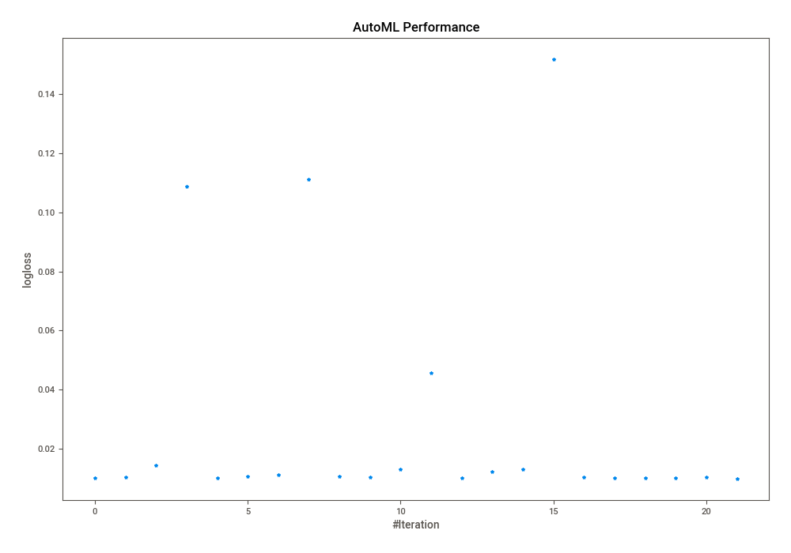
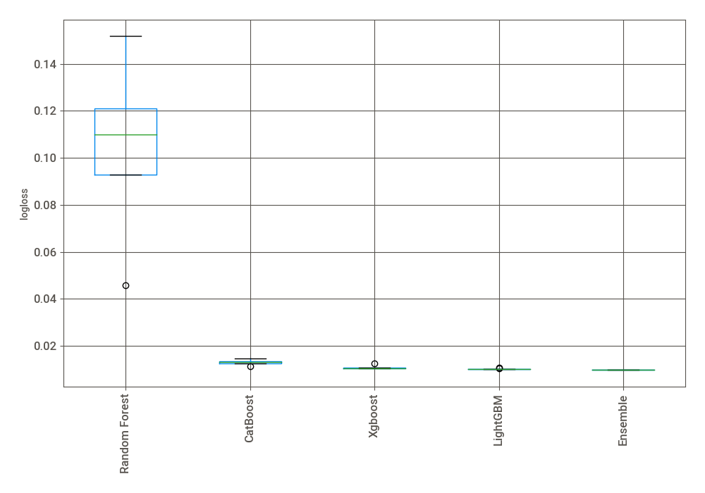
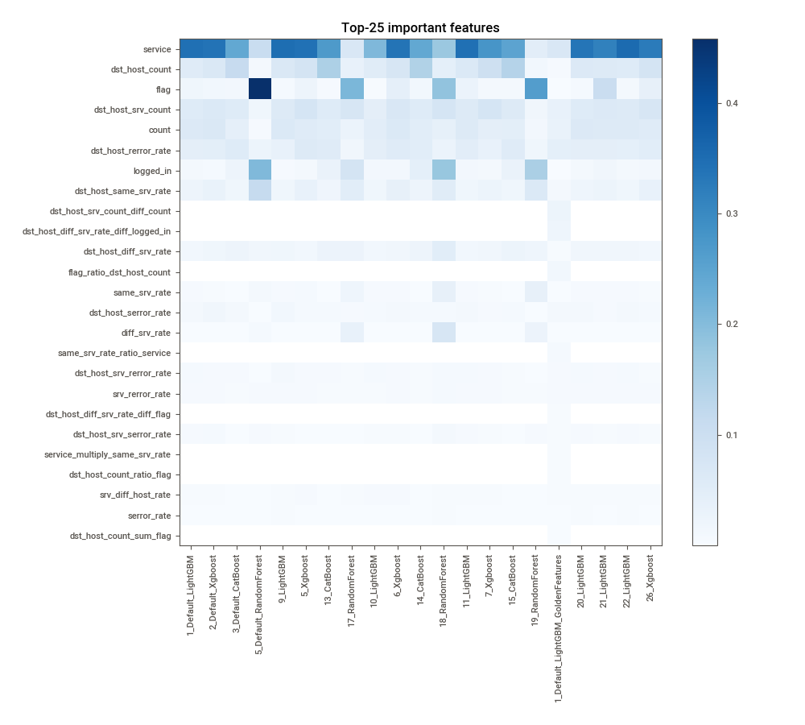
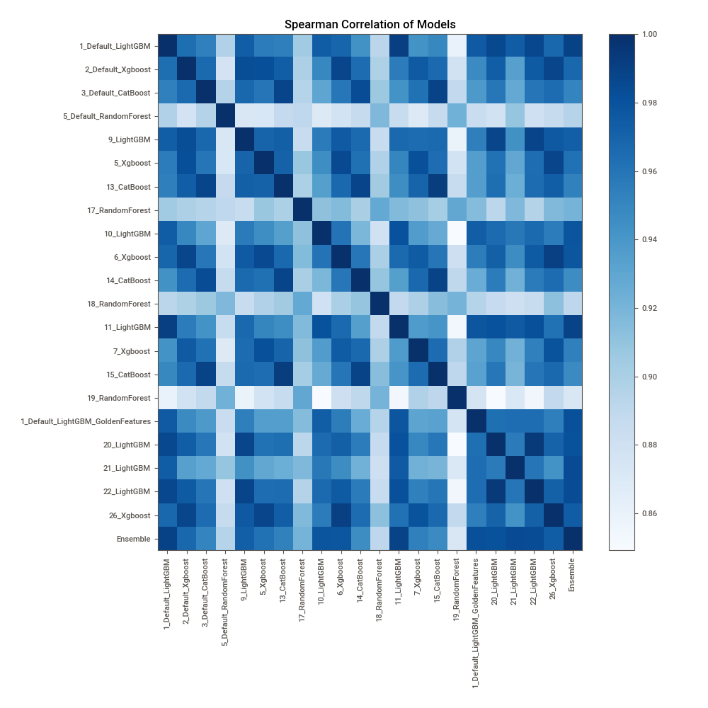

# AutoML Leaderboard

| Best model   | name                                                                             | model_type    | metric_type   |   metric_value |   train_time |   single_prediction_time |
|:-------------|:---------------------------------------------------------------------------------|:--------------|:--------------|---------------:|-------------:|-------------------------:|
|              | [1_Default_LightGBM](1_Default_LightGBM/README.md)                               | LightGBM      | logloss       |     0.0101937  |       222.28 |                   0.0334 |
|              | [2_Default_Xgboost](2_Default_Xgboost/README.md)                                 | Xgboost       | logloss       |     0.0104997  |       113.98 |                   0.0325 |
|              | [3_Default_CatBoost](3_Default_CatBoost/README.md)                               | CatBoost      | logloss       |     0.0146058  |        55.43 |                   0.0379 |
|              | [5_Default_RandomForest](5_Default_RandomForest/README.md)                       | Random Forest | logloss       |     0.108644   |        71.5  |                   0.1009 |
|              | [9_LightGBM](9_LightGBM/README.md)                                               | LightGBM      | logloss       |     0.010247   |       580.79 |                   0.0357 |
|              | [5_Xgboost](5_Xgboost/README.md)                                                 | Xgboost       | logloss       |     0.0107297  |       157.45 |                   0.0351 |
|              | [13_CatBoost](13_CatBoost/README.md)                                             | CatBoost      | logloss       |     0.011266   |       127.02 |                   0.0422 |
|              | [17_RandomForest](17_RandomForest/README.md)                                     | Random Forest | logloss       |     0.110989   |        49.06 |                   0.0819 |
|              | [10_LightGBM](10_LightGBM/README.md)                                             | LightGBM      | logloss       |     0.0107163  |       107.49 |                   0.0332 |
|              | [6_Xgboost](6_Xgboost/README.md)                                                 | Xgboost       | logloss       |     0.0103619  |       108.64 |                   0.0357 |
|              | [14_CatBoost](14_CatBoost/README.md)                                             | CatBoost      | logloss       |     0.0132567  |        54.17 |                   0.0378 |
|              | [18_RandomForest](18_RandomForest/README.md)                                     | Random Forest | logloss       |     0.045813   |        82.83 |                   0.0991 |
|              | [11_LightGBM](11_LightGBM/README.md)                                             | LightGBM      | logloss       |     0.0102048  |       224.7  |                   0.0386 |
|              | [7_Xgboost](7_Xgboost/README.md)                                                 | Xgboost       | logloss       |     0.0124527  |       263.96 |                   0.0391 |
|              | [15_CatBoost](15_CatBoost/README.md)                                             | CatBoost      | logloss       |     0.0131537  |        55.99 |                   0.0386 |
|              | [19_RandomForest](19_RandomForest/README.md)                                     | Random Forest | logloss       |     0.151761   |        64.42 |                   0.116  |
|              | [1_Default_LightGBM_GoldenFeatures](1_Default_LightGBM_GoldenFeatures/README.md) | LightGBM      | logloss       |     0.0104605  |       260.43 |                   0.0573 |
|              | [20_LightGBM](20_LightGBM/README.md)                                             | LightGBM      | logloss       |     0.010249   |       317.35 |                   0.0339 |
|              | [21_LightGBM](21_LightGBM/README.md)                                             | LightGBM      | logloss       |     0.0102397  |       208.2  |                   0.0328 |
|              | [22_LightGBM](22_LightGBM/README.md)                                             | LightGBM      | logloss       |     0.0102418  |       310.32 |                   0.0331 |
|              | [26_Xgboost](26_Xgboost/README.md)                                               | Xgboost       | logloss       |     0.0104339  |       111.67 |                   0.0336 |
| **the best** | [Ensemble](Ensemble/README.md)                                                   | Ensemble      | logloss       |     0.00984768 |        27.56 |                   0.2849 |

### AutoML Performance

### AutoML Performance Boxplot

### Features Importance

### Spearman Correlation of Models

