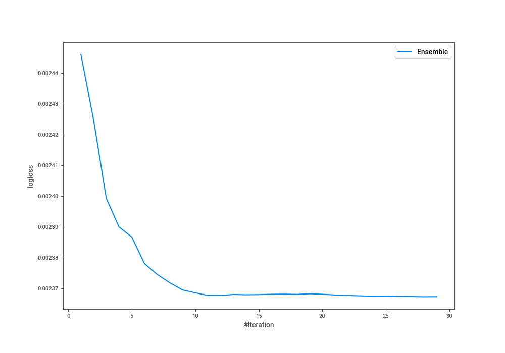
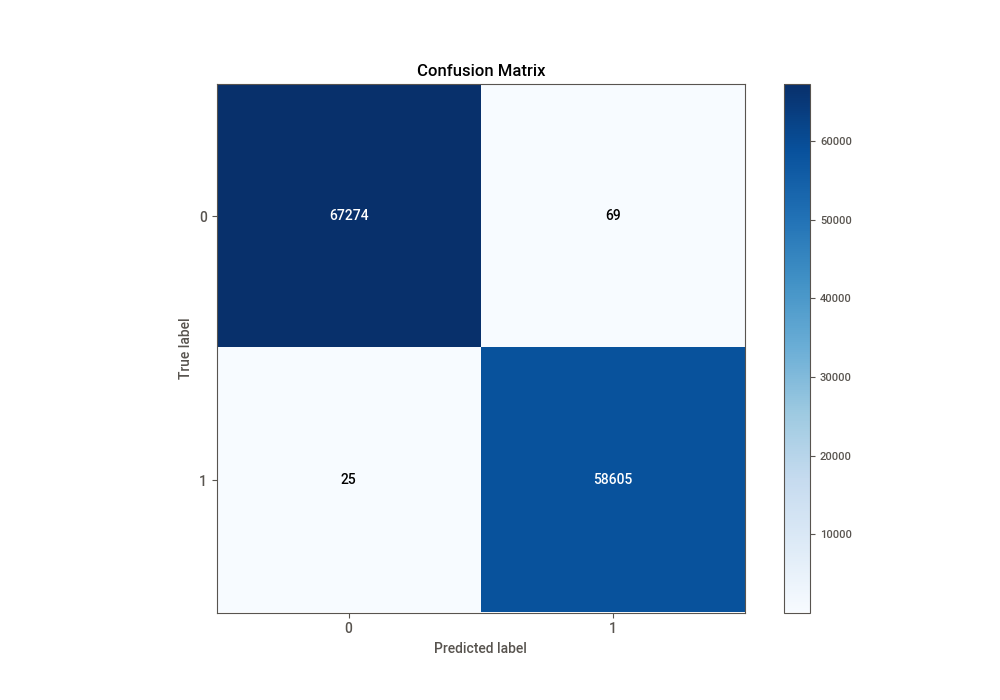
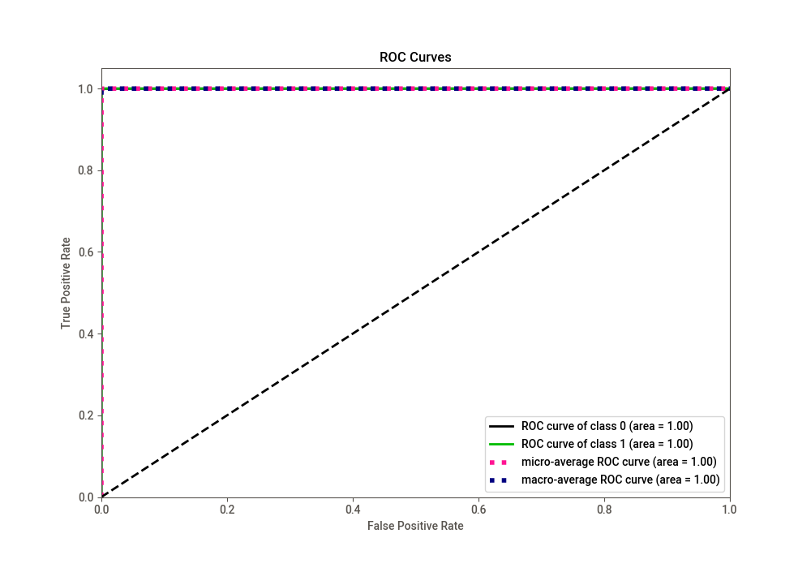
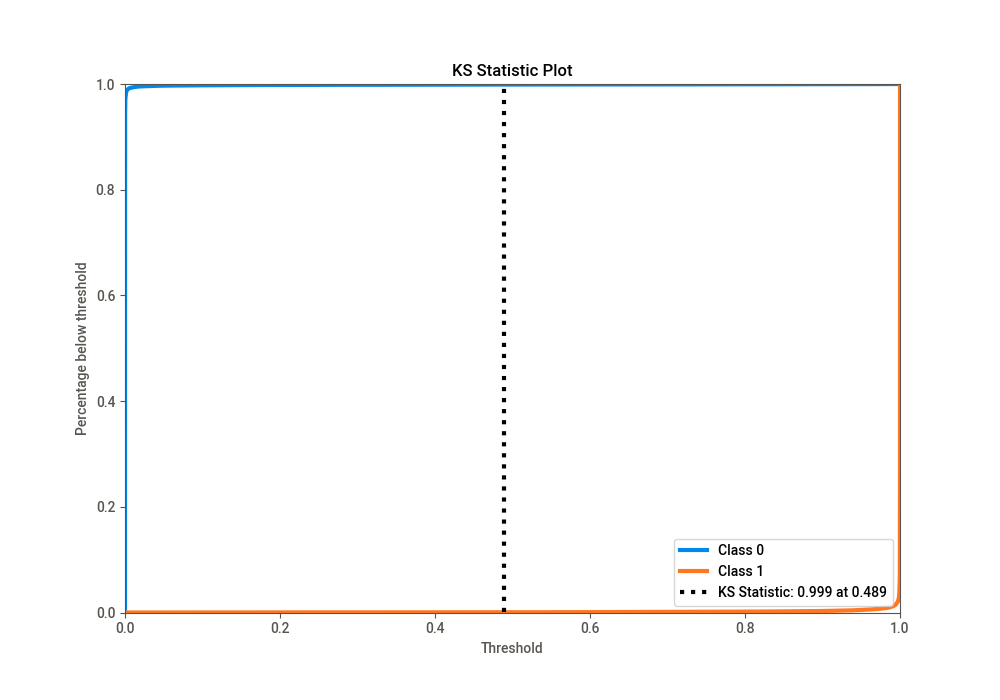
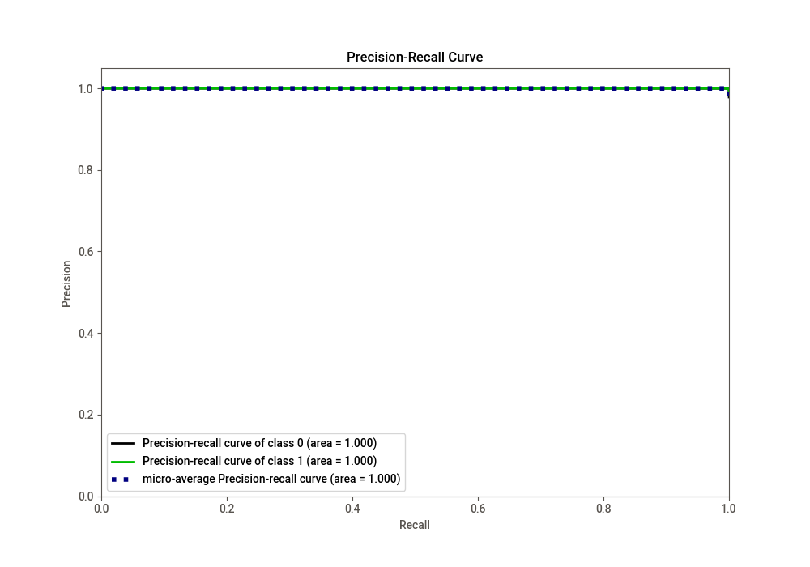
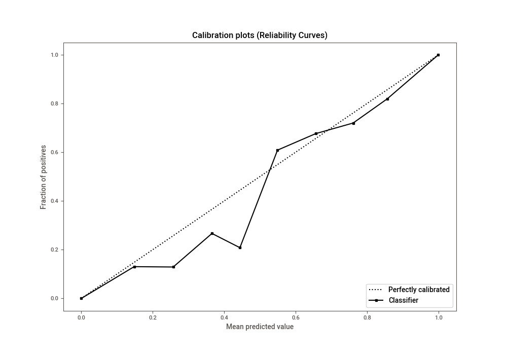
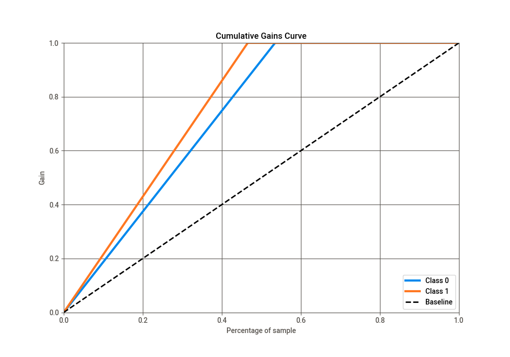
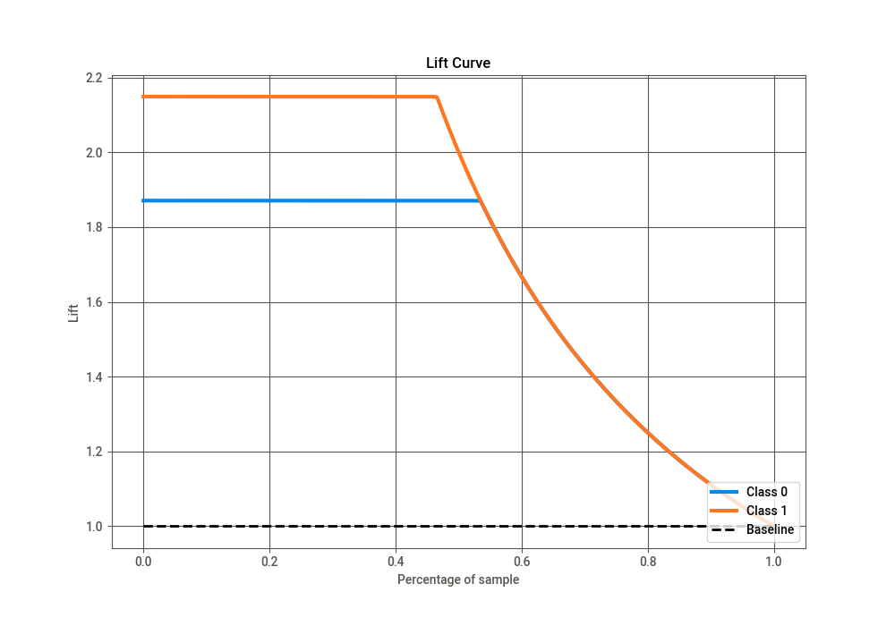

# Summary of Ensemble

[<< Go back](../README.md)

## Ensemble structure
| Model              |   Weight |
|:-------------------|---------:|
| 10_LightGBM        |        3 |
| 13_CatBoost        |        2 |
| 1_Default_LightGBM |        1 |
| 21_LightGBM        |       15 |
| 22_LightGBM        |        2 |
| 26_LightGBM        |        5 |

## Metric details
|           |      score |     threshold |
|:----------|-----------:|--------------:|
| logloss   | 0.00236729 | nan           |
| auc       | 0.999996   | nan           |
| f1        | 0.999199   |   0.5         |
| accuracy  | 0.999254   |   0.5         |
| precision | 1          |   0.999975    |
| recall    | 1          |   1.83948e-07 |
| mcc       | 0.998501   |   0.5         |

## Confusion matrix (at threshold=0.5)
|              |   Predicted as 0 |   Predicted as 1 |
|:-------------|-----------------:|-----------------:|
| Labeled as 0 |            67274 |               69 |
| Labeled as 1 |               25 |            58605 |

## Learning curves

## Confusion Matrix

## Normalized Confusion Matrix

## ROC Curve

## Kolmogorov-Smirnov Statistic

## Precision-Recall Curve

## Calibration Curve

## Cumulative Gains Curve

## Lift Curve

[<< Go back](../README.md)
