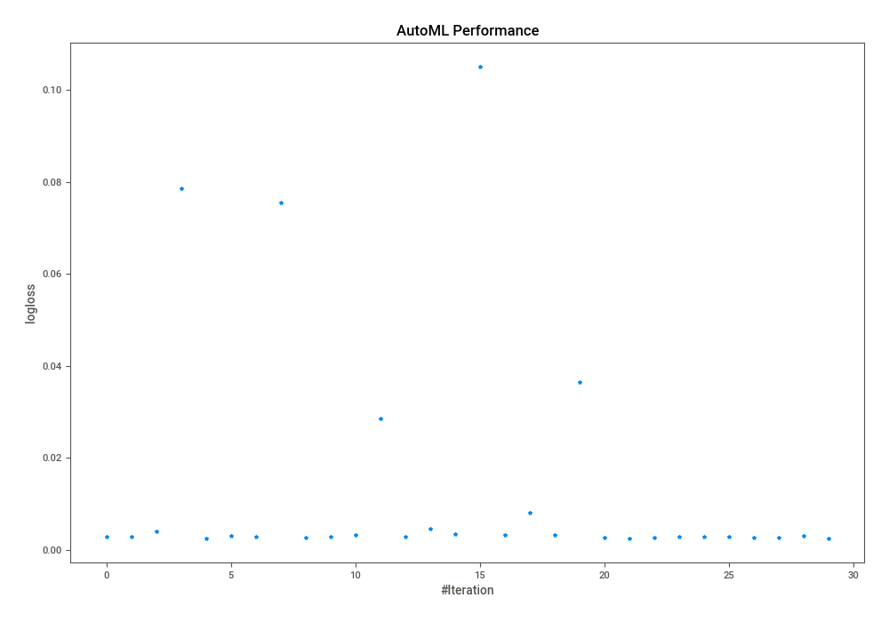
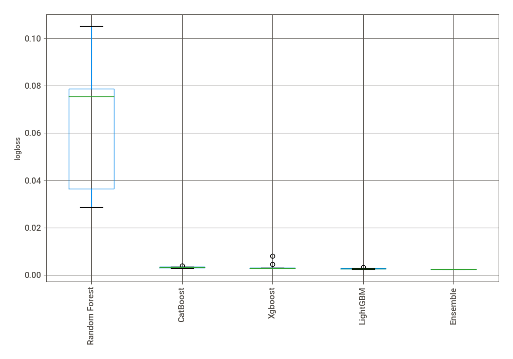
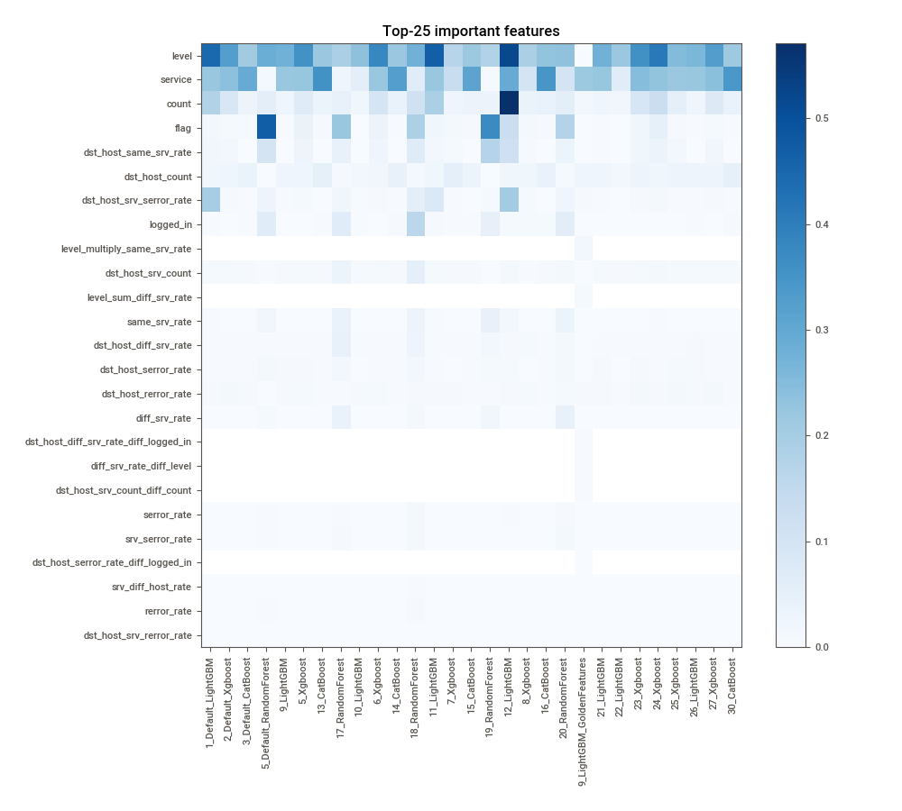
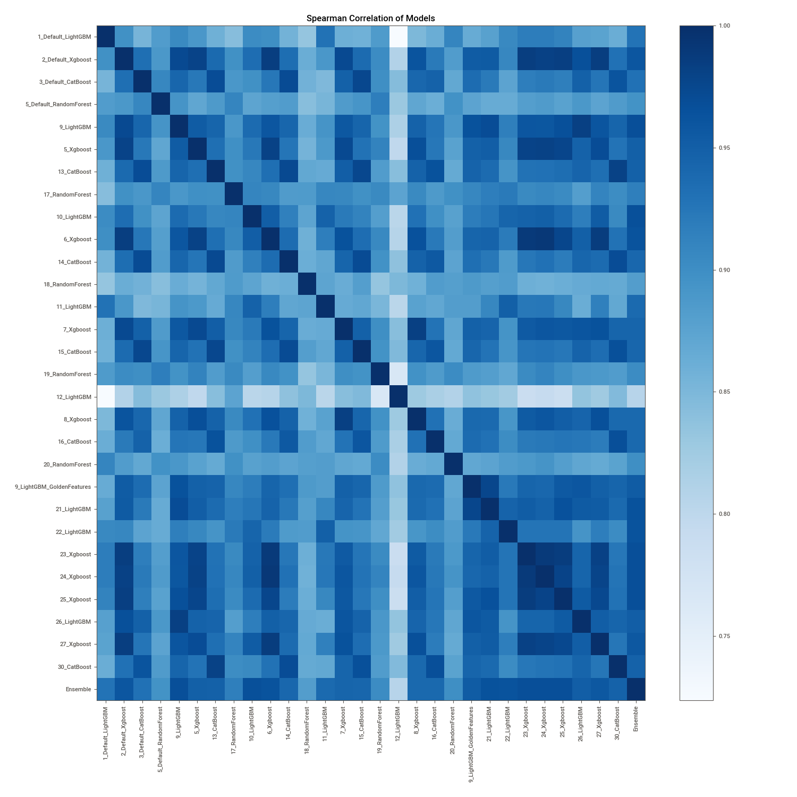

# AutoML Leaderboard

| Best model   | name                                                             | model_type    | metric_type   |   metric_value |   train_time |   single_prediction_time |
|:-------------|:-----------------------------------------------------------------|:--------------|:--------------|---------------:|-------------:|-------------------------:|
|              | [1_Default_LightGBM](1_Default_LightGBM/README.md)               | LightGBM      | logloss       |     0.00274489 |       135.82 |                   0.0384 |
|              | [2_Default_Xgboost](2_Default_Xgboost/README.md)                 | Xgboost       | logloss       |     0.002792   |        85.8  |                   0.0392 |
|              | [3_Default_CatBoost](3_Default_CatBoost/README.md)               | CatBoost      | logloss       |     0.0039142  |       137.89 |                   0.0399 |
|              | [5_Default_RandomForest](5_Default_RandomForest/README.md)       | Random Forest | logloss       |     0.0786419  |        57.86 |                   0.0864 |
|              | [9_LightGBM](9_LightGBM/README.md)                               | LightGBM      | logloss       |     0.00251887 |       249.96 |                   0.0407 |
|              | [5_Xgboost](5_Xgboost/README.md)                                 | Xgboost       | logloss       |     0.00306027 |       100.67 |                   0.0428 |
|              | [13_CatBoost](13_CatBoost/README.md)                             | CatBoost      | logloss       |     0.00289457 |       220.06 |                   0.0399 |
|              | [17_RandomForest](17_RandomForest/README.md)                     | Random Forest | logloss       |     0.0754331  |        37.76 |                   0.0935 |
|              | [10_LightGBM](10_LightGBM/README.md)                             | LightGBM      | logloss       |     0.00268208 |        82.14 |                   0.0387 |
|              | [6_Xgboost](6_Xgboost/README.md)                                 | Xgboost       | logloss       |     0.00277194 |        77.22 |                   0.0411 |
|              | [14_CatBoost](14_CatBoost/README.md)                             | CatBoost      | logloss       |     0.00313622 |       182.05 |                   0.0385 |
|              | [18_RandomForest](18_RandomForest/README.md)                     | Random Forest | logloss       |     0.028524   |        62.77 |                   0.0888 |
|              | [11_LightGBM](11_LightGBM/README.md)                             | LightGBM      | logloss       |     0.00275957 |       149.82 |                   0.038  |
|              | [7_Xgboost](7_Xgboost/README.md)                                 | Xgboost       | logloss       |     0.00455847 |       143.57 |                   0.0389 |
|              | [15_CatBoost](15_CatBoost/README.md)                             | CatBoost      | logloss       |     0.00344268 |       102.31 |                   0.0382 |
|              | [19_RandomForest](19_RandomForest/README.md)                     | Random Forest | logloss       |     0.105103   |        69.01 |                   0.1197 |
|              | [12_LightGBM](12_LightGBM/README.md)                             | LightGBM      | logloss       |     0.00324005 |       156.39 |                   0.0385 |
|              | [8_Xgboost](8_Xgboost/README.md)                                 | Xgboost       | logloss       |     0.00809756 |       122.34 |                   0.0489 |
|              | [16_CatBoost](16_CatBoost/README.md)                             | CatBoost      | logloss       |     0.00314919 |        94.22 |                   0.0408 |
|              | [20_RandomForest](20_RandomForest/README.md)                     | Random Forest | logloss       |     0.0364414  |        42.79 |                   0.087  |
|              | [9_LightGBM_GoldenFeatures](9_LightGBM_GoldenFeatures/README.md) | LightGBM      | logloss       |     0.00270703 |       338.85 |                   0.0649 |
|              | [21_LightGBM](21_LightGBM/README.md)                             | LightGBM      | logloss       |     0.002446   |       152.97 |                   0.0418 |
|              | [22_LightGBM](22_LightGBM/README.md)                             | LightGBM      | logloss       |     0.00260996 |       134.55 |                   0.0386 |
|              | [23_Xgboost](23_Xgboost/README.md)                               | Xgboost       | logloss       |     0.00275695 |        92.64 |                   0.0506 |
|              | [24_Xgboost](24_Xgboost/README.md)                               | Xgboost       | logloss       |     0.00280664 |        85.69 |                   0.0447 |
|              | [25_Xgboost](25_Xgboost/README.md)                               | Xgboost       | logloss       |     0.00280123 |        93.98 |                   0.0547 |
|              | [26_LightGBM](26_LightGBM/README.md)                             | LightGBM      | logloss       |     0.00256862 |        88.8  |                   0.0403 |
|              | [27_Xgboost](27_Xgboost/README.md)                               | Xgboost       | logloss       |     0.00271601 |        89.19 |                   0.0385 |
|              | [30_CatBoost](30_CatBoost/README.md)                             | CatBoost      | logloss       |     0.00302514 |       203.49 |                   0.0411 |
| **the best** | [Ensemble](Ensemble/README.md)                                   | Ensemble      | logloss       |     0.00236729 |        46.86 |                   0.2627 |

### AutoML Performance

### AutoML Performance Boxplot

### Features Importance

### Spearman Correlation of Models

