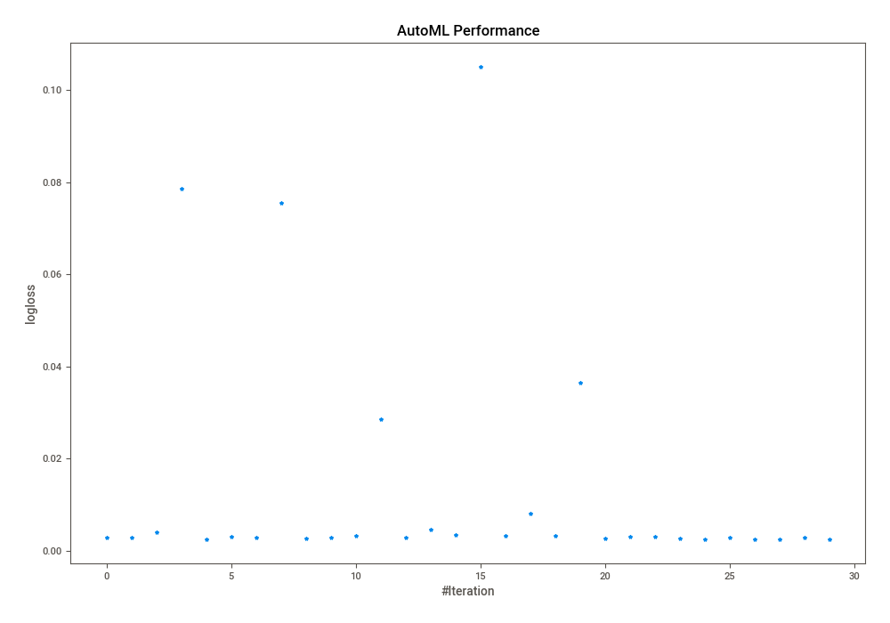
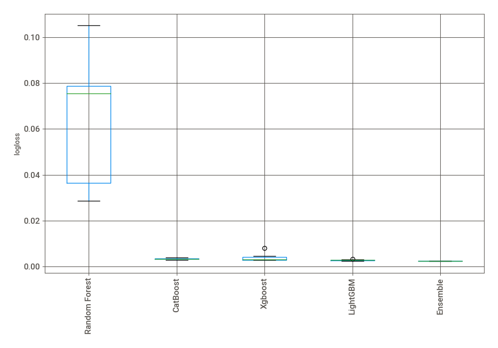
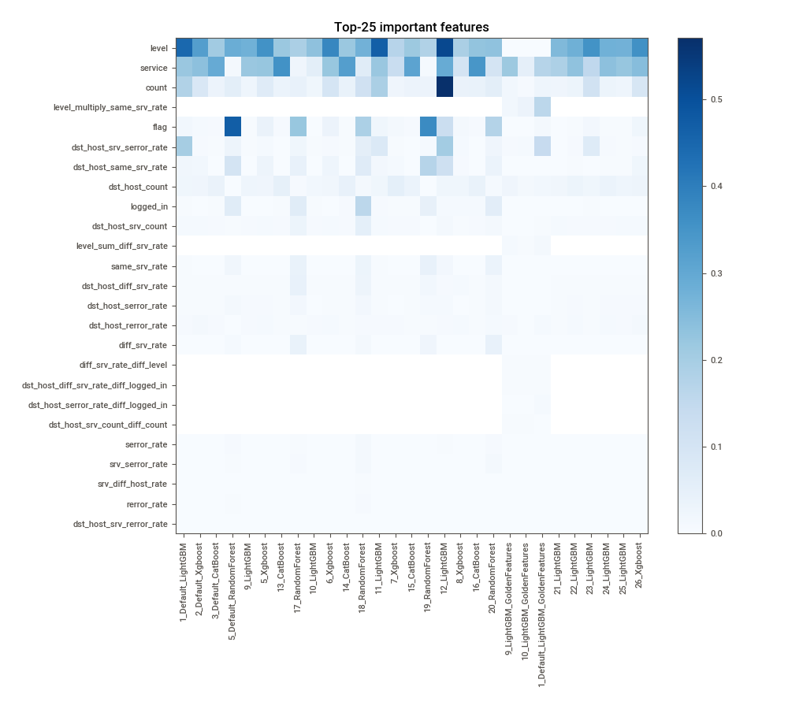
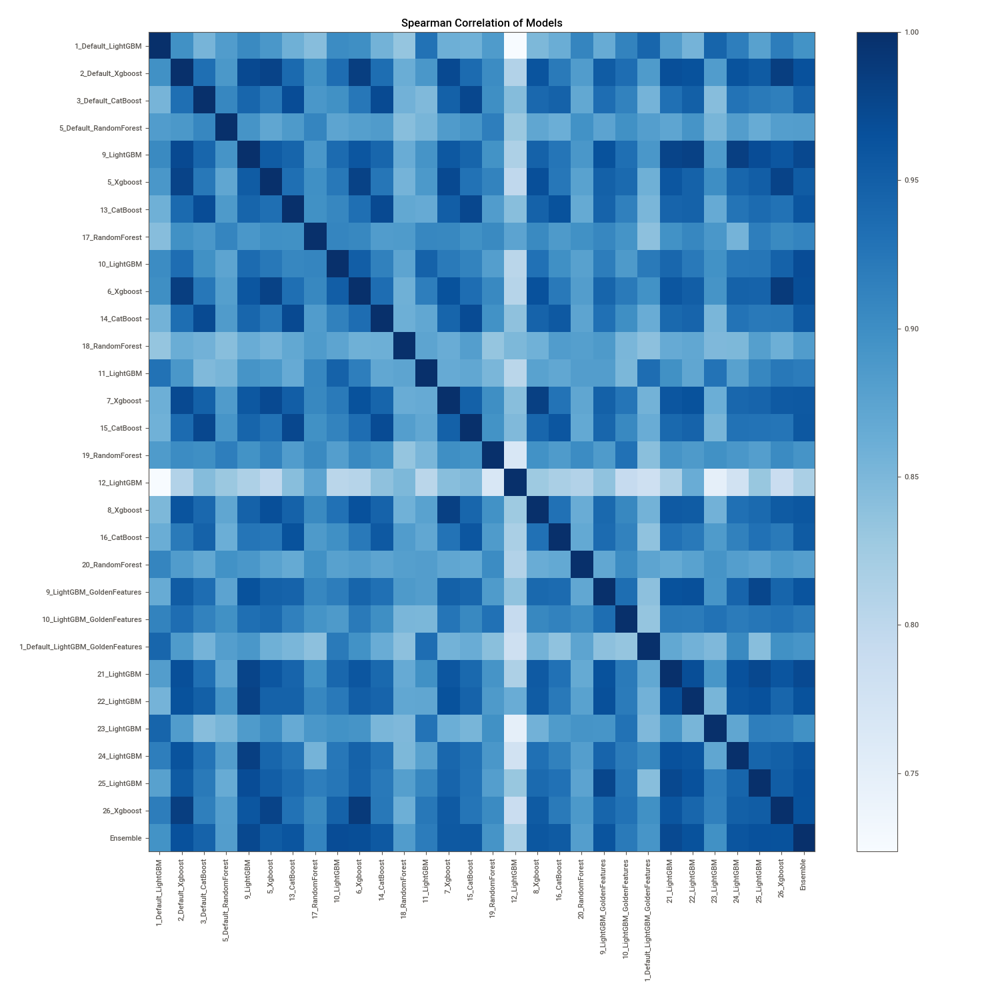

# AutoML Leaderboard

| Best model   | name                                                                             | model_type    | metric_type   |   metric_value |   train_time |   single_prediction_time |
|:-------------|:---------------------------------------------------------------------------------|:--------------|:--------------|---------------:|-------------:|-------------------------:|
|              | [1_Default_LightGBM](1_Default_LightGBM/README.md)                               | LightGBM      | logloss       |     0.00274489 |       139.93 |                   0.0367 |
|              | [2_Default_Xgboost](2_Default_Xgboost/README.md)                                 | Xgboost       | logloss       |     0.002792   |       112.73 |                   0.0336 |
|              | [3_Default_CatBoost](3_Default_CatBoost/README.md)                               | CatBoost      | logloss       |     0.00391239 |       134.31 |                   0.0348 |
|              | [5_Default_RandomForest](5_Default_RandomForest/README.md)                       | Random Forest | logloss       |     0.0786419  |        54.4  |                   0.0768 |
|              | [9_LightGBM](9_LightGBM/README.md)                                               | LightGBM      | logloss       |     0.00251887 |       235.08 |                   0.0338 |
|              | [5_Xgboost](5_Xgboost/README.md)                                                 | Xgboost       | logloss       |     0.00306027 |        84.37 |                   0.0332 |
|              | [13_CatBoost](13_CatBoost/README.md)                                             | CatBoost      | logloss       |     0.00289457 |       188.97 |                   0.0338 |
|              | [17_RandomForest](17_RandomForest/README.md)                                     | Random Forest | logloss       |     0.0754331  |        35.01 |                   0.0879 |
|              | [10_LightGBM](10_LightGBM/README.md)                                             | LightGBM      | logloss       |     0.00268208 |        79.34 |                   0.0348 |
|              | [6_Xgboost](6_Xgboost/README.md)                                                 | Xgboost       | logloss       |     0.00277194 |        62.91 |                   0.0327 |
|              | [14_CatBoost](14_CatBoost/README.md)                                             | CatBoost      | logloss       |     0.00312854 |       167.7  |                   0.0331 |
|              | [18_RandomForest](18_RandomForest/README.md)                                     | Random Forest | logloss       |     0.028524   |        57.56 |                   0.0832 |
|              | [11_LightGBM](11_LightGBM/README.md)                                             | LightGBM      | logloss       |     0.00275957 |       143.77 |                   0.0333 |
|              | [7_Xgboost](7_Xgboost/README.md)                                                 | Xgboost       | logloss       |     0.00455847 |       111.42 |                   0.0345 |
|              | [15_CatBoost](15_CatBoost/README.md)                                             | CatBoost      | logloss       |     0.00344268 |        82.35 |                   0.0342 |
|              | [19_RandomForest](19_RandomForest/README.md)                                     | Random Forest | logloss       |     0.105103   |        61.13 |                   0.1107 |
|              | [12_LightGBM](12_LightGBM/README.md)                                             | LightGBM      | logloss       |     0.00324005 |       149.53 |                   0.0355 |
|              | [8_Xgboost](8_Xgboost/README.md)                                                 | Xgboost       | logloss       |     0.00809756 |        91.03 |                   0.0415 |
|              | [16_CatBoost](16_CatBoost/README.md)                                             | CatBoost      | logloss       |     0.00314919 |        76.99 |                   0.0337 |
|              | [20_RandomForest](20_RandomForest/README.md)                                     | Random Forest | logloss       |     0.0364414  |        36.85 |                   0.0741 |
|              | [9_LightGBM_GoldenFeatures](9_LightGBM_GoldenFeatures/README.md)                 | LightGBM      | logloss       |     0.00270693 |       276.62 |                   0.0546 |
|              | [10_LightGBM_GoldenFeatures](10_LightGBM_GoldenFeatures/README.md)               | LightGBM      | logloss       |     0.00309465 |        75.48 |                   0.0519 |
|              | [1_Default_LightGBM_GoldenFeatures](1_Default_LightGBM_GoldenFeatures/README.md) | LightGBM      | logloss       |     0.00306697 |       138.31 |                   0.0525 |
|              | [21_LightGBM](21_LightGBM/README.md)                                             | LightGBM      | logloss       |     0.00259538 |       361.63 |                   0.0339 |
|              | [22_LightGBM](22_LightGBM/README.md)                                             | LightGBM      | logloss       |     0.00251481 |       215.39 |                   0.0345 |
|              | [23_LightGBM](23_LightGBM/README.md)                                             | LightGBM      | logloss       |     0.00274762 |        62.63 |                   0.0325 |
|              | [24_LightGBM](24_LightGBM/README.md)                                             | LightGBM      | logloss       |     0.00245531 |       122.77 |                   0.0328 |
|              | [25_LightGBM](25_LightGBM/README.md)                                             | LightGBM      | logloss       |     0.002446   |       131.36 |                   0.0325 |
|              | [26_Xgboost](26_Xgboost/README.md)                                               | Xgboost       | logloss       |     0.00275695 |        64.84 |                   0.0723 |
| **the best** | [Ensemble](Ensemble/README.md)                                                   | Ensemble      | logloss       |     0.00235261 |        39.54 |                   0.164  |

### AutoML Performance

### AutoML Performance Boxplot

### Features Importance

### Spearman Correlation of Models

