# Exploratory Data Analysis

[<< Go back](../README.md)
## Feature : target
- **Feature type** : discrete
- **Missing** : 0.0%
- **Unique** : 2
- **Count** :125973.0
- **Mean** :0.4654171925730117
- **Std** :0.49880457546470763
- **Min** :0.0
- **25%th Percentile** : 0.0
- **50%th Percentile** : 0.0
- **75%th Percentile** : 1.0
- **Max** :1.0

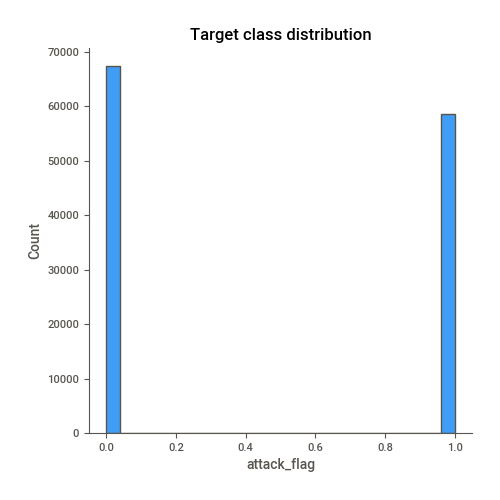
## Feature : same_srv_rate
- **Feature type** : continous
- **Missing** : 0.0%
- **Unique** : 101
- **Count** :125973.0
- **Mean** :0.6609276591015536
- **Std** :0.4396228624074802
- **Min** :0.0
- **25%th Percentile** : 0.09
- **50%th Percentile** : 1.0
- **75%th Percentile** : 1.0
- **Max** :1.0

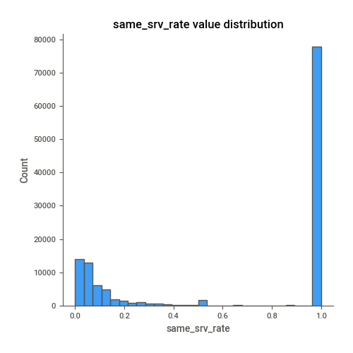
## Feature : dst_host_srv_count
- **Feature type** : discrete
- **Missing** : 0.0%
- **Unique** : 256
- **Count** :125973.0
- **Mean** :115.65300500900987
- **Std** :110.70274078086479
- **Min** :0.0
- **25%th Percentile** : 10.0
- **50%th Percentile** : 63.0
- **75%th Percentile** : 255.0
- **Max** :255.0

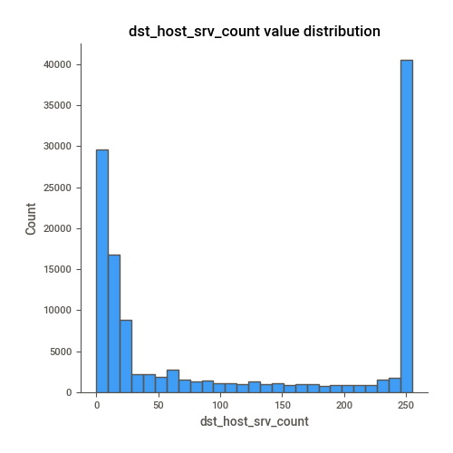
## Feature : dst_host_same_srv_rate
- **Feature type** : continous
- **Missing** : 0.0%
- **Unique** : 101
- **Count** :125973.0
- **Mean** :0.5212416946488534
- **Std** :0.44894936371767924
- **Min** :0.0
- **25%th Percentile** : 0.05
- **50%th Percentile** : 0.51
- **75%th Percentile** : 1.0
- **Max** :1.0

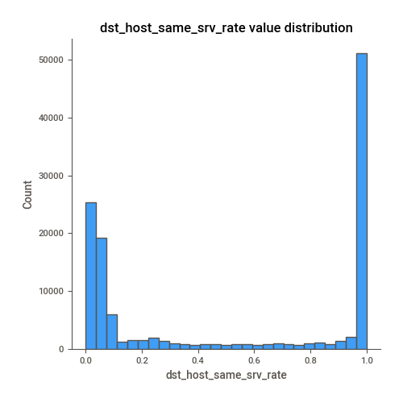
## Feature : dst_host_srv_serror_rate
- **Feature type** : continous
- **Missing** : 0.0%
- **Unique** : 100
- **Count** :125973.0
- **Mean** :0.27848451652338196
- **Std** :0.4456691238860302
- **Min** :0.0
- **25%th Percentile** : 0.0
- **50%th Percentile** : 0.0
- **75%th Percentile** : 1.0
- **Max** :1.0

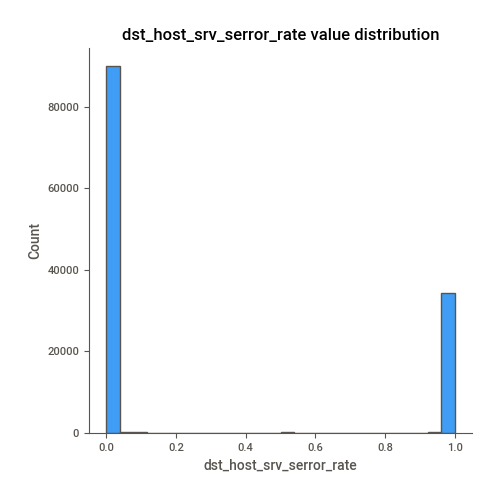
## Feature : dst_host_serror_rate
- **Feature type** : continous
- **Missing** : 0.0%
- **Unique** : 101
- **Count** :125973.0
- **Mean** :0.28445246203551555
- **Std** :0.4447840503164888
- **Min** :0.0
- **25%th Percentile** : 0.0
- **50%th Percentile** : 0.0
- **75%th Percentile** : 1.0
- **Max** :1.0

## Feature : serror_rate
- **Feature type** : continous
- **Missing** : 0.0%
- **Unique** : 89
- **Count** :125973.0
- **Mean** :0.2844845323998
- **Std** :0.4464556243310234
- **Min** :0.0
- **25%th Percentile** : 0.0
- **50%th Percentile** : 0.0
- **75%th Percentile** : 1.0
- **Max** :1.0

## Feature : dst_host_diff_srv_rate
- **Feature type** : continous
- **Missing** : 0.0%
- **Unique** : 101
- **Count** :125973.0
- **Mean** :0.08295110857088424
- **Std** :0.18892179990461463
- **Min** :0.0
- **25%th Percentile** : 0.0
- **50%th Percentile** : 0.02
- **75%th Percentile** : 0.07
- **Max** :1.0

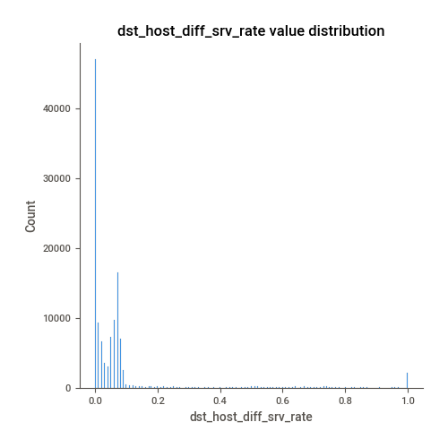
## Feature : diff_srv_rate
- **Feature type** : continous
- **Missing** : 0.0%
- **Unique** : 95
- **Count** :125973.0
- **Mean** :0.06305263826375493
- **Std** :0.18031440750857483
- **Min** :0.0
- **25%th Percentile** : 0.0
- **50%th Percentile** : 0.0
- **75%th Percentile** : 0.06
- **Max** :1.0

## Feature : srv_diff_host_rate
- **Feature type** : continous
- **Missing** : 0.0%
- **Unique** : 60
- **Count** :125973.0
- **Mean** :0.09732164828971289
- **Std** :0.2598304981211585
- **Min** :0.0
- **25%th Percentile** : 0.0
- **50%th Percentile** : 0.0
- **75%th Percentile** : 0.0
- **Max** :1.0

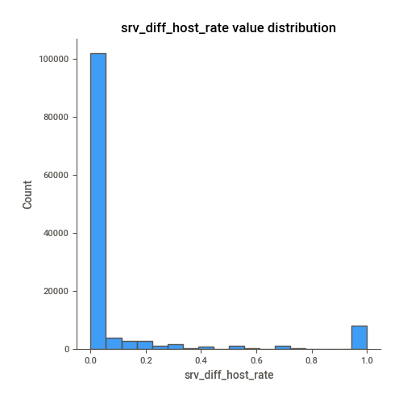
## Feature : service
- **Feature type** : categorical
- **Missing** : 0.0%
- **Unique** : 70
- **Count** :125973
- **Unique** :70
- **Top** :http
- **Freq** :40338

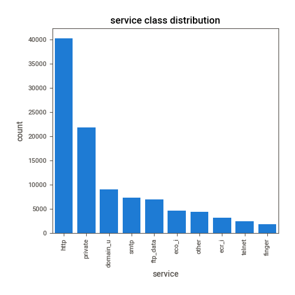
## Feature : flag
- **Feature type** : categorical
- **Missing** : 0.0%
- **Unique** : 11
- **Count** :125973
- **Unique** :11
- **Top** :SF
- **Freq** :74945

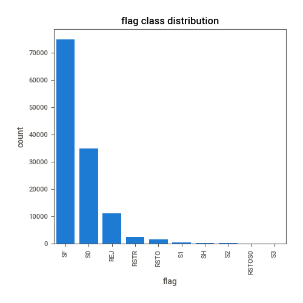
## Feature : logged_in
- **Feature type** : discrete
- **Missing** : 0.0%
- **Unique** : 2
- **Count** :125973.0
- **Mean** :0.3957355941352512
- **Std** :0.4890100530052412
- **Min** :0.0
- **25%th Percentile** : 0.0
- **50%th Percentile** : 0.0
- **75%th Percentile** : 1.0
- **Max** :1.0

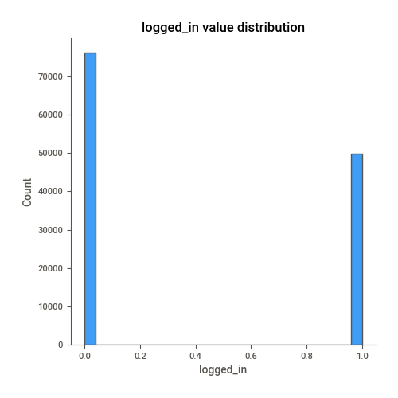
## Feature : srv_serror_rate
- **Feature type** : continous
- **Missing** : 0.0%
- **Unique** : 86
- **Count** :125973.0
- **Mean** :0.28248537384995204
- **Std** :0.447022498364017
- **Min** :0.0
- **25%th Percentile** : 0.0
- **50%th Percentile** : 0.0
- **75%th Percentile** : 1.0
- **Max** :1.0

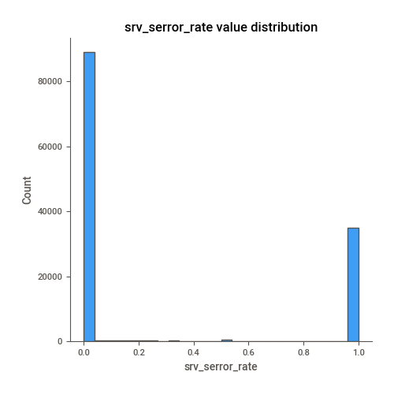
## Feature : count
- **Feature type** : discrete
- **Missing** : 0.0%
- **Unique** : 512
- **Count** :125973.0
- **Mean** :84.1075547934875
- **Std** :114.5086073541841
- **Min** :0.0
- **25%th Percentile** : 2.0
- **50%th Percentile** : 14.0
- **75%th Percentile** : 143.0
- **Max** :511.0

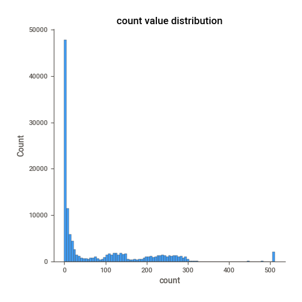
## Feature : level
- **Feature type** : discrete
- **Missing** : 0.0%
- **Unique** : 22
- **Count** :125973.0
- **Mean** :19.50406039389393
- **Std** :2.291502939101359
- **Min** :0.0
- **25%th Percentile** : 18.0
- **50%th Percentile** : 20.0
- **75%th Percentile** : 21.0
- **Max** :21.0

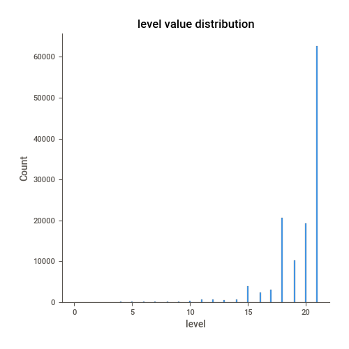
## Feature : dst_host_count
- **Feature type** : discrete
- **Missing** : 0.0%
- **Unique** : 256
- **Count** :125973.0
- **Mean** :182.14894461511594
- **Std** :99.20621303459785
- **Min** :0.0
- **25%th Percentile** : 82.0
- **50%th Percentile** : 255.0
- **75%th Percentile** : 255.0
- **Max** :255.0

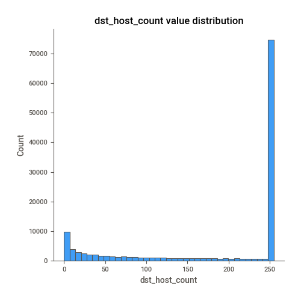
## Feature : srv_rerror_rate
- **Feature type** : continous
- **Missing** : 0.0%
- **Unique** : 62
- **Count** :125973.0
- **Mean** :0.12118326943075104
- **Std** :0.32364722800546286
- **Min** :0.0
- **25%th Percentile** : 0.0
- **50%th Percentile** : 0.0
- **75%th Percentile** : 0.0
- **Max** :1.0

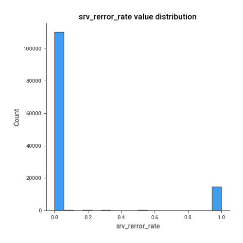
## Feature : dst_host_srv_rerror_rate
- **Feature type** : continous
- **Missing** : 0.0%
- **Unique** : 101
- **Count** :125973.0
- **Mean** :0.12023989267541457
- **Std** :0.31945939045523164
- **Min** :0.0
- **25%th Percentile** : 0.0
- **50%th Percentile** : 0.0
- **75%th Percentile** : 0.0
- **Max** :1.0

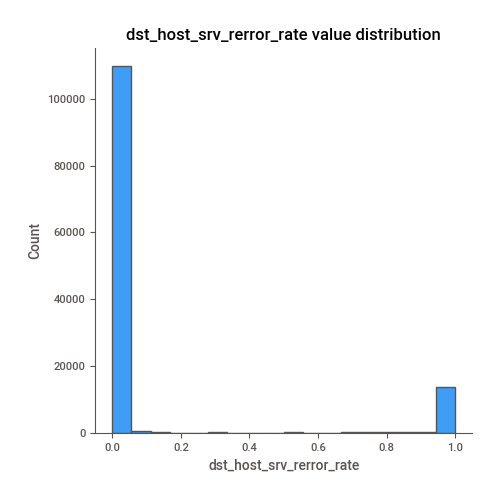
## Feature : rerror_rate
- **Feature type** : continous
- **Missing** : 0.0%
- **Unique** : 82
- **Count** :125973.0
- **Mean** :0.11995848316702784
- **Std** :0.3204355207495171
- **Min** :0.0
- **25%th Percentile** : 0.0
- **50%th Percentile** : 0.0
- **75%th Percentile** : 0.0
- **Max** :1.0

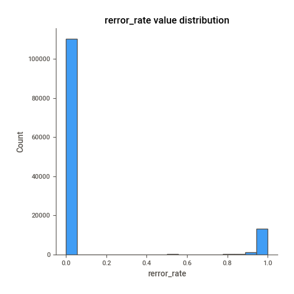
## Feature : dst_host_rerror_rate
- **Feature type** : continous
- **Missing** : 0.0%
- **Unique** : 101
- **Count** :125973.0
- **Mean** :0.11883181316631342
- **Std** :0.30655745802516937
- **Min** :0.0
- **25%th Percentile** : 0.0
- **50%th Percentile** : 0.0
- **75%th Percentile** : 0.0
- **Max** :1.0

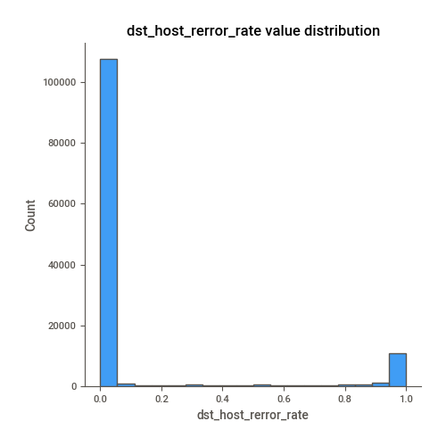

[<< Go back](../README.md)
