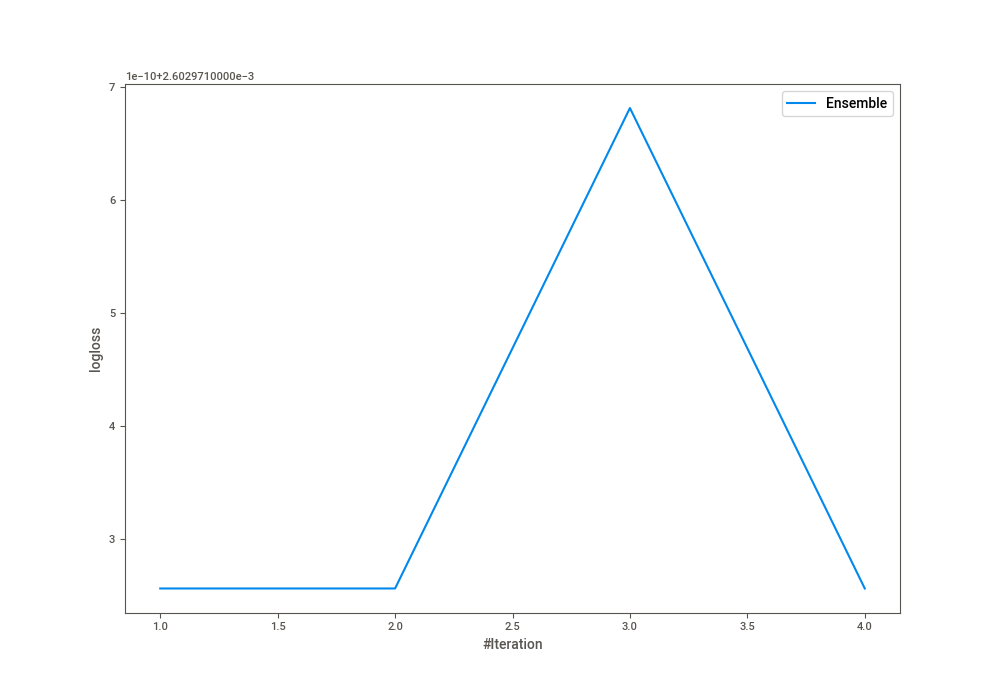
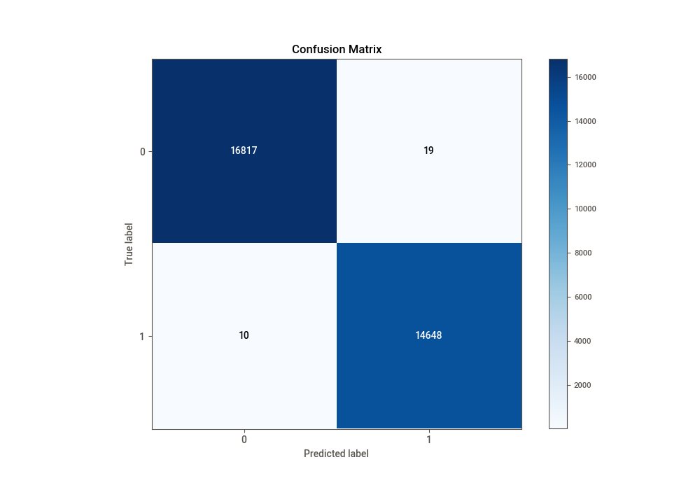
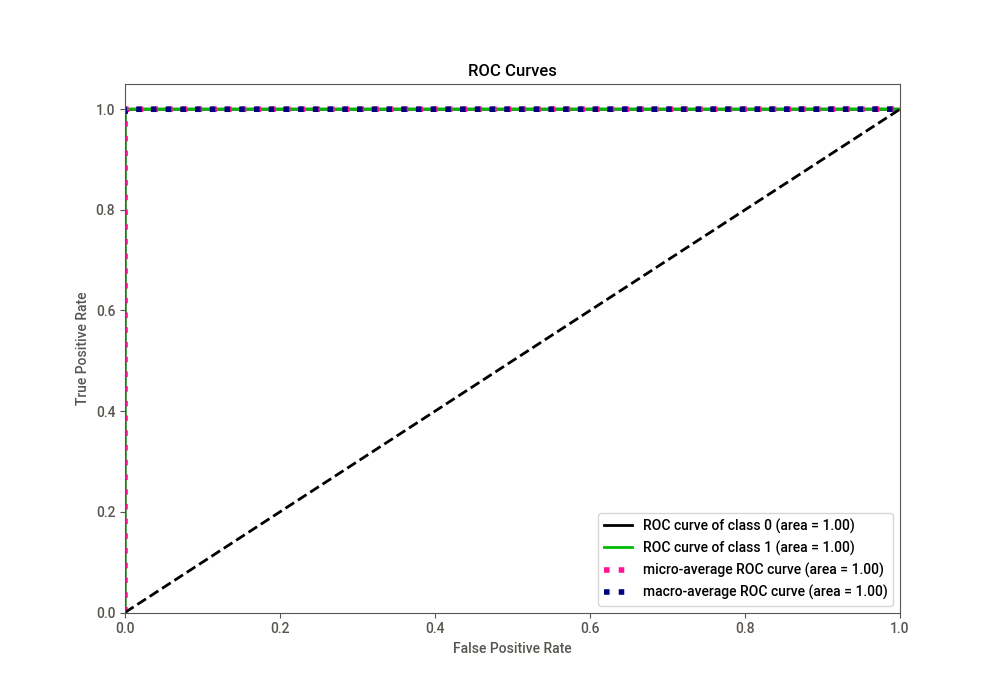
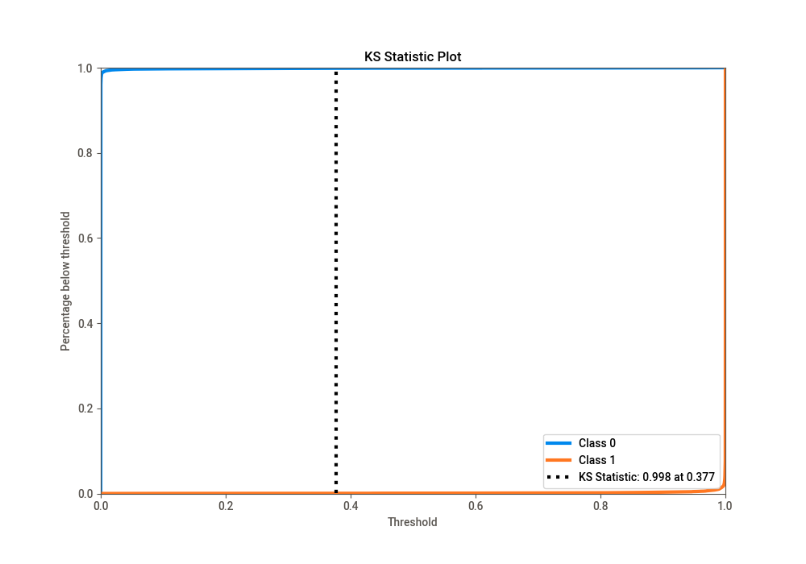
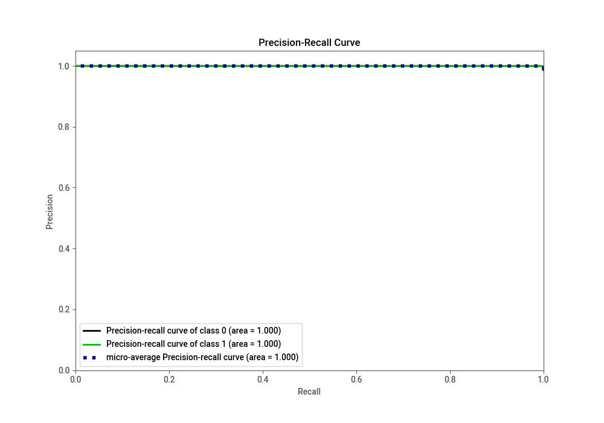
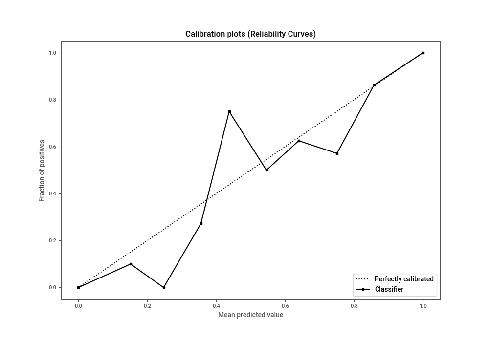
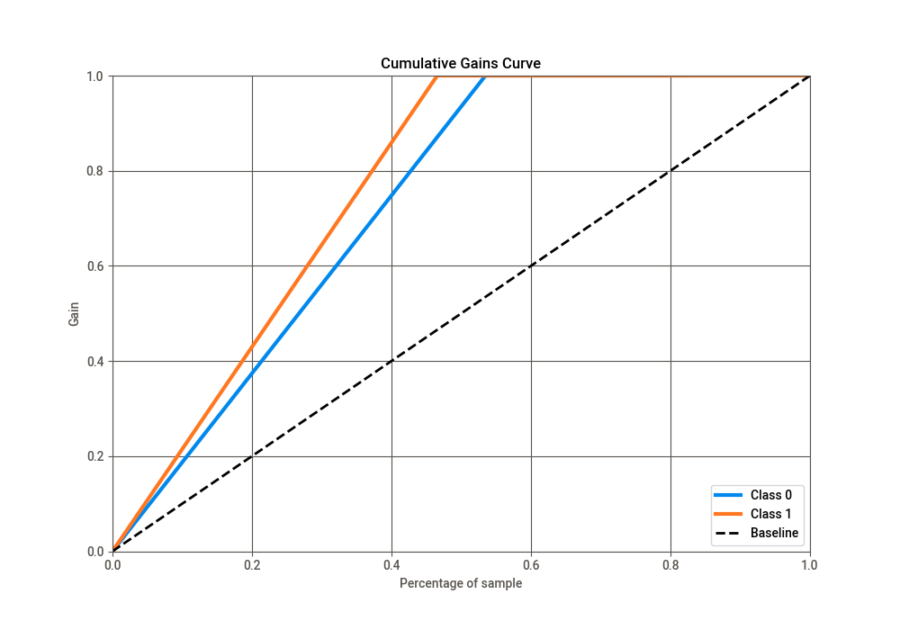
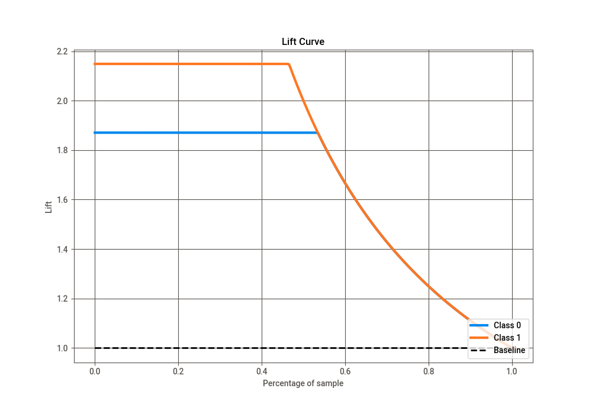

# Summary of Ensemble

[<< Go back](../README.md)

## Ensemble structure
| Model             |   Weight |
|:------------------|---------:|
| 3_Default_Xgboost |        1 |

## Metric details
|           |      score |     threshold |
|:----------|-----------:|--------------:|
| logloss   | 0.00260297 | nan           |
| auc       | 0.999996   | nan           |
| f1        | 0.999011   |   0.500003    |
| accuracy  | 0.999079   |   0.500003    |
| precision | 0.998705   |   0.500003    |
| recall    | 1          |   3.39738e-09 |
| mcc       | 0.99815    |   0.500003    |

## Confusion matrix (at threshold=0.500003)
|              |   Predicted as 0 |   Predicted as 1 |
|:-------------|-----------------:|-----------------:|
| Labeled as 0 |            16817 |               19 |
| Labeled as 1 |               10 |            14648 |

## Learning curves

## Confusion Matrix

## Normalized Confusion Matrix

## ROC Curve

## Kolmogorov-Smirnov Statistic

## Precision-Recall Curve

## Calibration Curve

## Cumulative Gains Curve

## Lift Curve

[<< Go back](../README.md)
