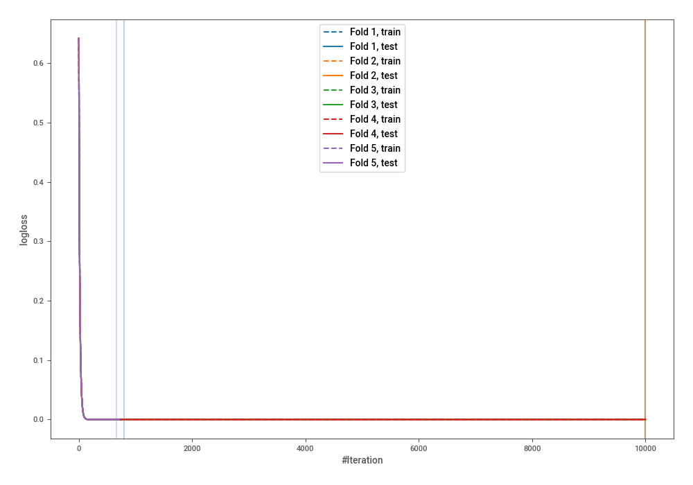
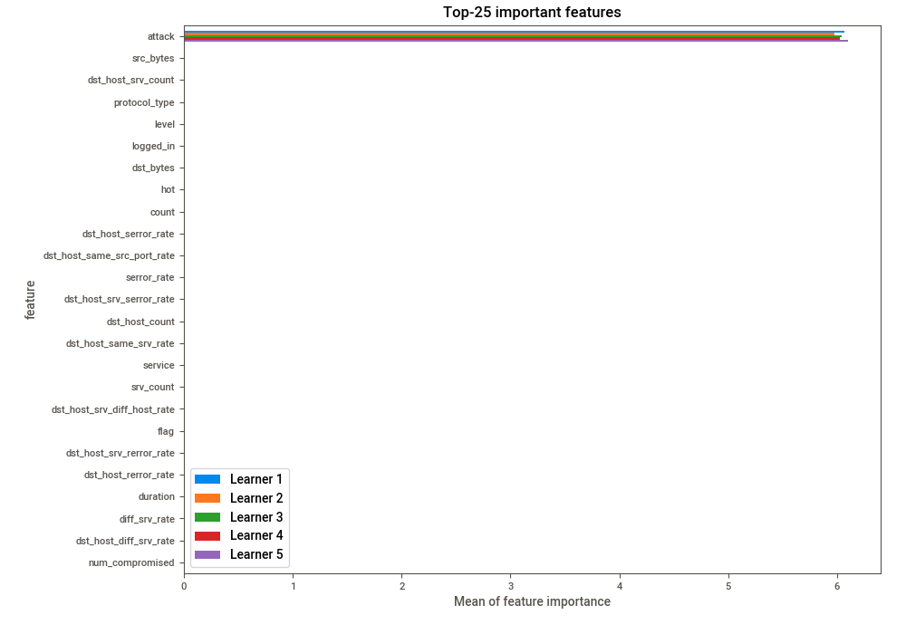
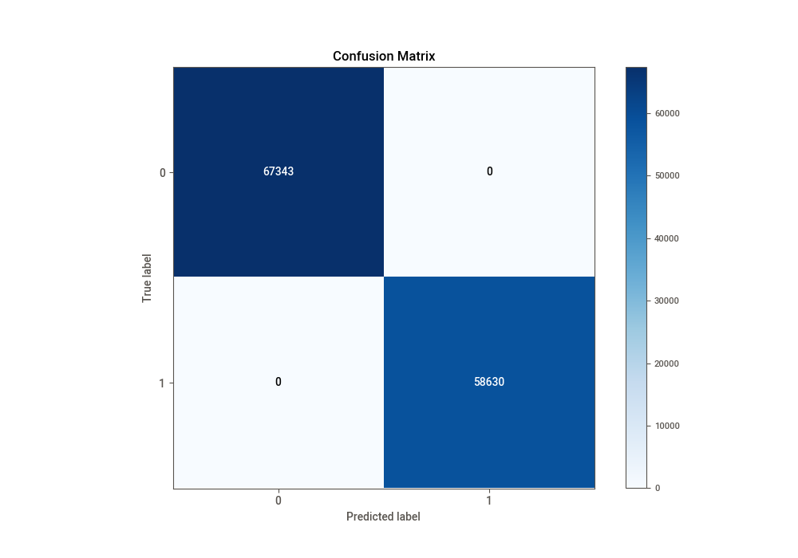
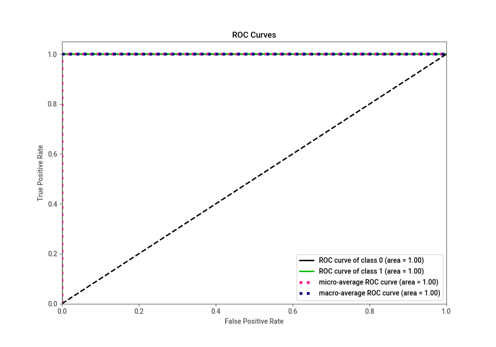
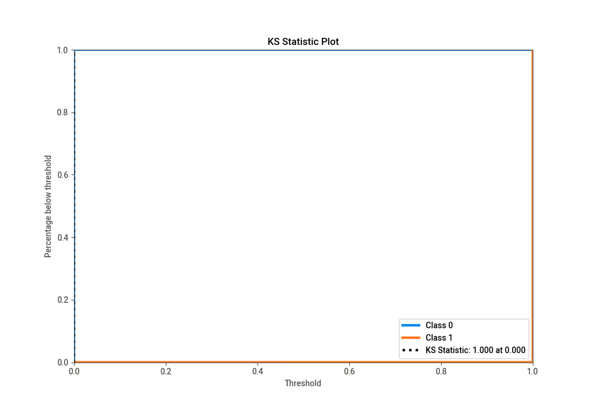
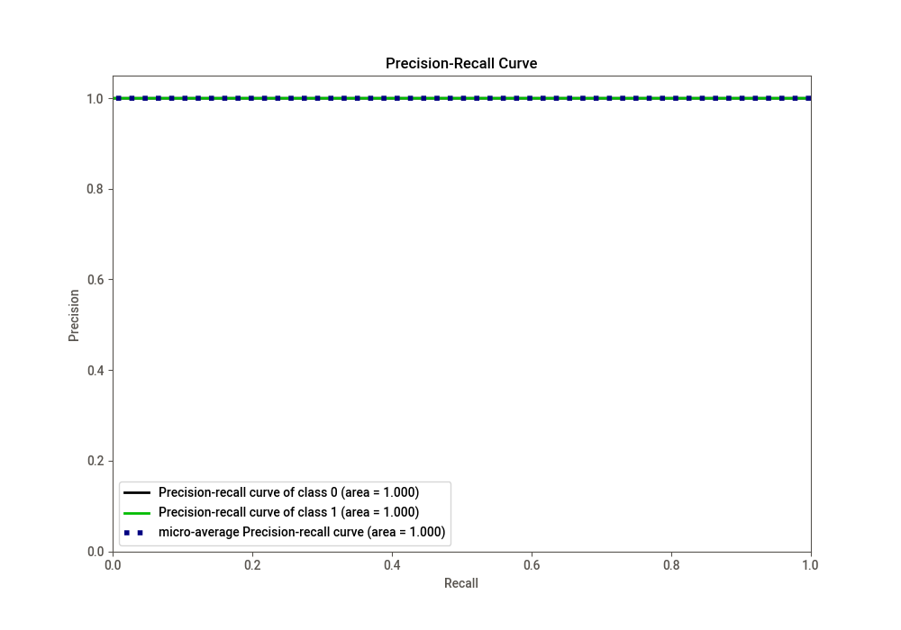
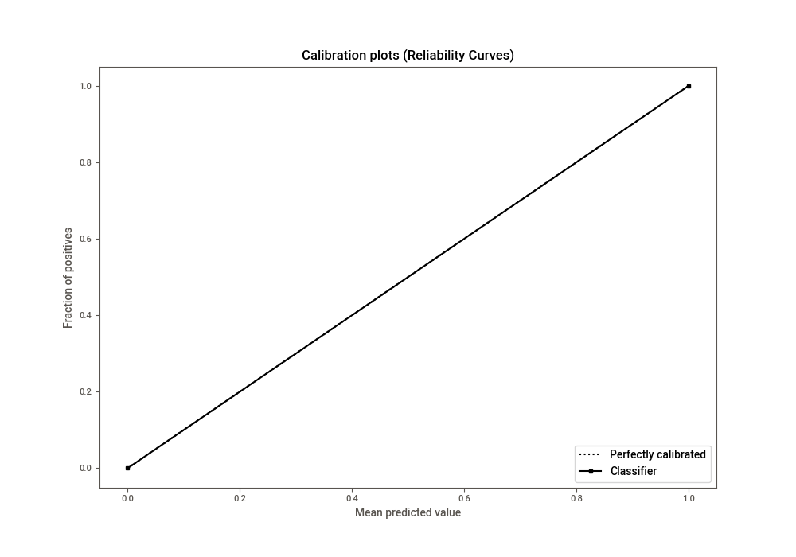
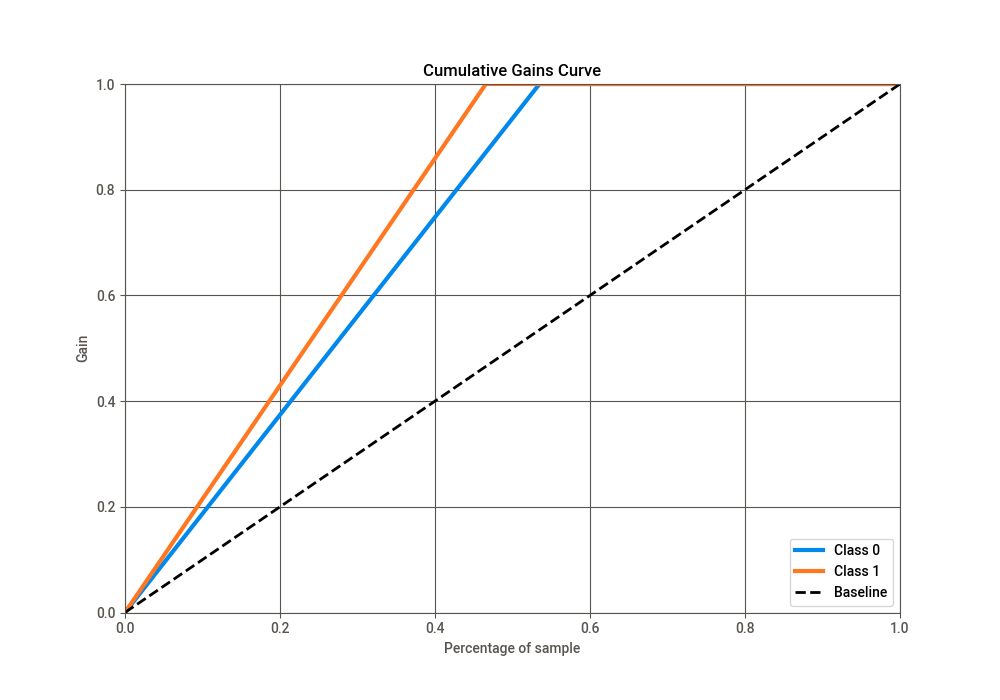
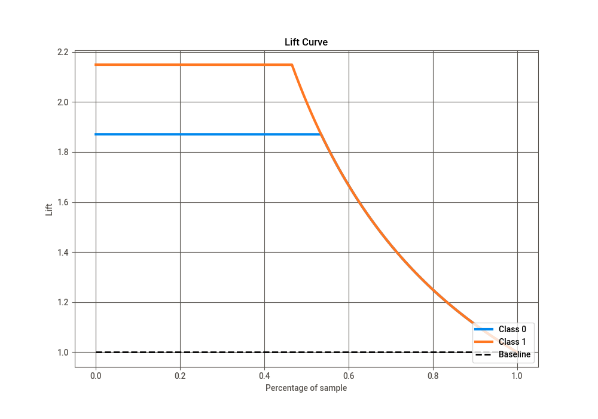

# Summary of 1_Default_LightGBM

[<< Go back](../README.md)

## LightGBM
- **n_jobs**: -1
- **objective**: binary
- **num_leaves**: 63
- **learning_rate**: 0.05
- **feature_fraction**: 0.9
- **bagging_fraction**: 0.9
- **min_data_in_leaf**: 10
- **metric**: binary_logloss
- **custom_eval_metric_name**: None
- **explain_level**: 1

## Validation
 - **validation_type**: kfold
 - **k_folds**: 5
 - **shuffle**: True
 - **stratify**: True

## Optimized metric
logloss

## Training time

5248.8 seconds

## Metric details
|           |       score |     threshold |
|:----------|------------:|--------------:|
| logloss   | 1.00032e-06 | nan           |
| auc       | 1           | nan           |
| f1        | 1           |   0.5         |
| accuracy  | 1           |   0.5         |
| precision | 1           |   0.5         |
| recall    | 1           |   1.41877e-10 |
| mcc       | 1           |   0.5         |

## Confusion matrix (at threshold=0.5)
|              |   Predicted as 0 |   Predicted as 1 |
|:-------------|-----------------:|-----------------:|
| Labeled as 0 |            67343 |                0 |
| Labeled as 1 |                0 |            58630 |

## Learning curves

## Permutation-based Importance

## Confusion Matrix

## Normalized Confusion Matrix

## ROC Curve

## Kolmogorov-Smirnov Statistic

## Precision-Recall Curve

## Calibration Curve

## Cumulative Gains Curve

## Lift Curve

[<< Go back](../README.md)
