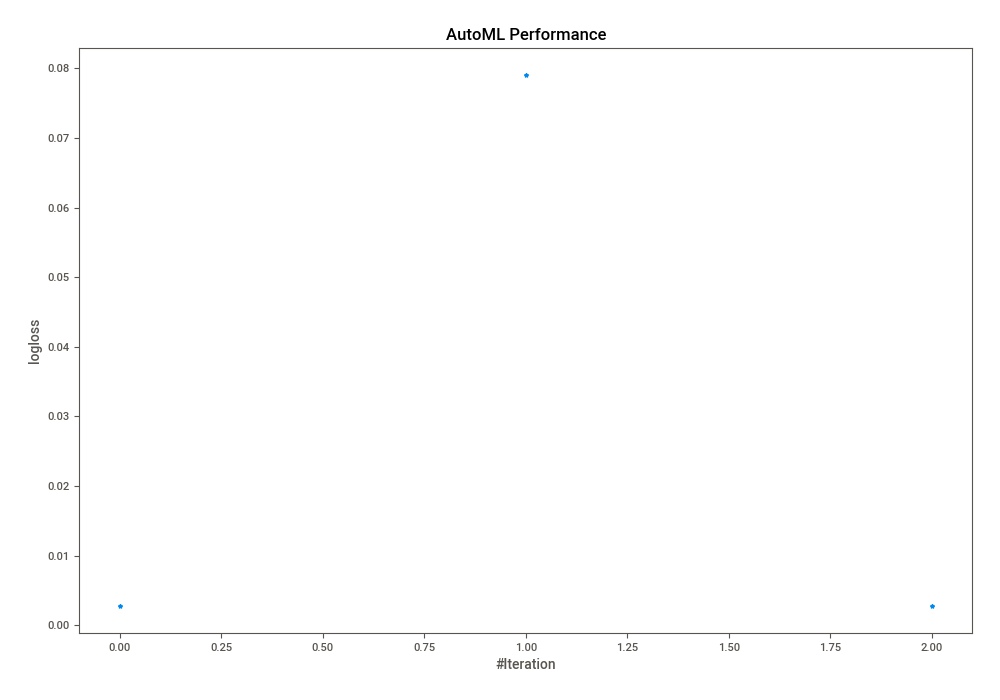
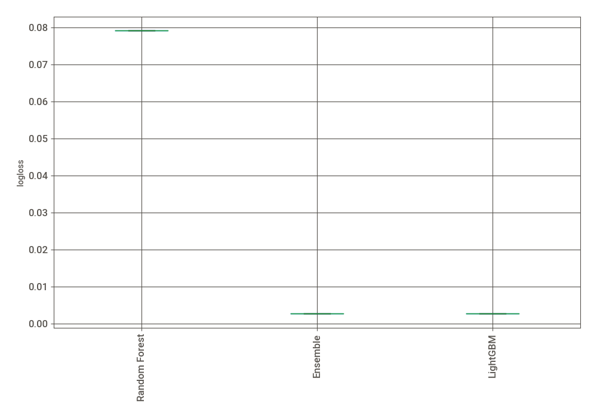
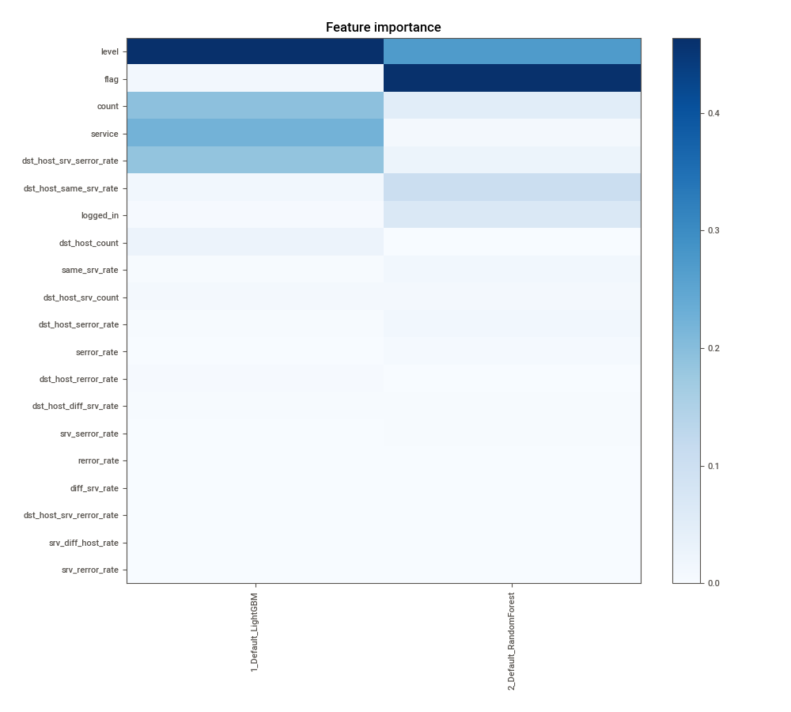
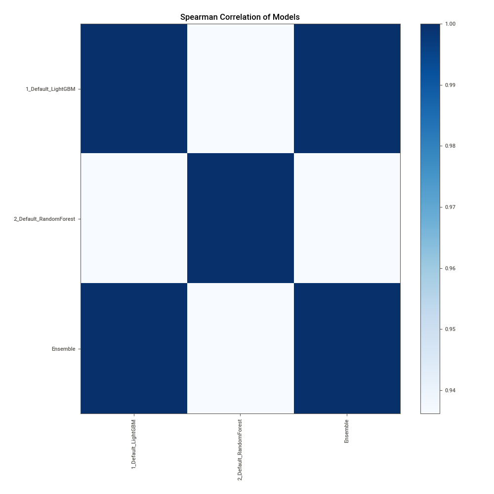

# AutoML Leaderboard

| Best model   | name                                                       | model_type    | metric_type   |   metric_value |   train_time |
|:-------------|:-----------------------------------------------------------|:--------------|:--------------|---------------:|-------------:|
| **the best** | [1_Default_LightGBM](1_Default_LightGBM/README.md)         | LightGBM      | logloss       |     0.00272884 |        50.6  |
|              | [2_Default_RandomForest](2_Default_RandomForest/README.md) | Random Forest | logloss       |     0.0790827  |        12.92 |
|              | [Ensemble](Ensemble/README.md)                             | Ensemble      | logloss       |     0.00272884 |         4.11 |

### AutoML Performance

### AutoML Performance Boxplot

### Features Importance

### Spearman Correlation of Models

