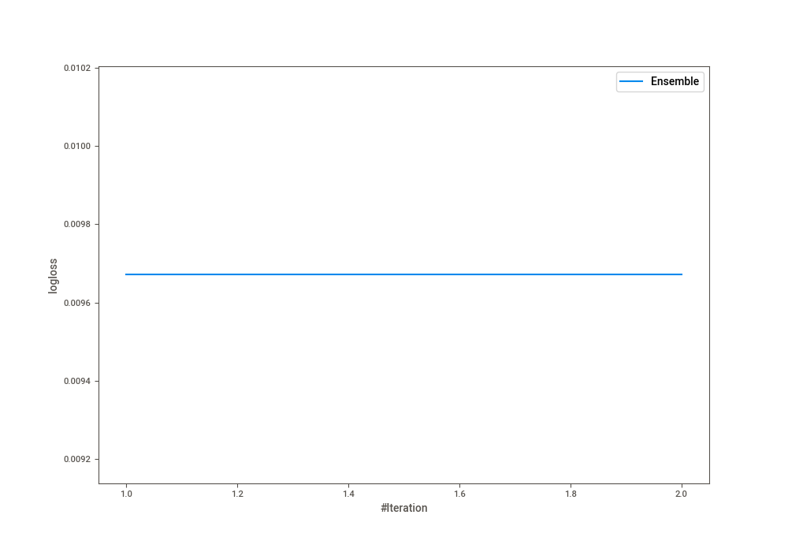

# Summary of Ensemble

[<< Go back](../README.md)

## Ensemble structure
| Model              |   Weight |
|:-------------------|---------:|
| 1_Default_LightGBM |        1 |

## Metric details
|           |      score |     threshold |
|:----------|-----------:|--------------:|
| logloss   | 0.00967124 | nan           |
| auc       | 0.999919   | nan           |
| f1        | 0.996078   |   0.442561    |
| accuracy  | 0.996349   |   0.442561    |
| precision | 1          |   1           |
| recall    | 1          |   4.50624e-08 |
| mcc       | 0.992662   |   0.442561    |

## Confusion matrix (at threshold=0.442561)
|              |   Predicted as 0 |   Predicted as 1 |
|:-------------|-----------------:|-----------------:|
| Labeled as 0 |            16776 |               60 |
| Labeled as 1 |               55 |            14603 |

## Learning curves

## Confusion Matrix

## Normalized Confusion Matrix

## ROC Curve

## Kolmogorov-Smirnov Statistic

## Precision-Recall Curve

## Calibration Curve

## Cumulative Gains Curve

## Lift Curve

[<< Go back](../README.md)
