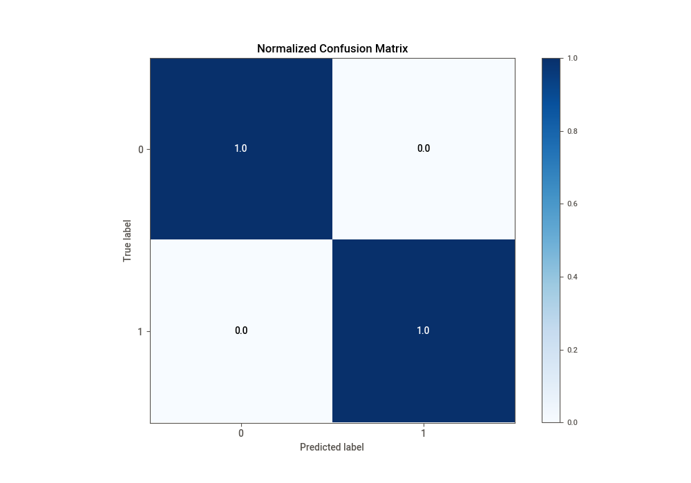

# Summary of Ensemble

[<< Go back](../README.md)

## Ensemble structure
| Model                      |   Weight |
|:---------------------------|---------:|
| 10_LightGBM                |        3 |
| 10_LightGBM_GoldenFeatures |        3 |
| 24_LightGBM                |        9 |
| 25_LightGBM                |        8 |

## Metric details
|           |      score |     threshold |
|:----------|-----------:|--------------:|
| logloss   | 0.00233978 | nan           |
| auc       | 0.999996   | nan           |
| f1        | 0.999207   |   0.5         |
| accuracy  | 0.999262   |   0.5         |
| precision | 1          |   0.999982    |
| recall    | 1          |   5.68053e-08 |
| mcc       | 0.998517   |   0.5         |

## Confusion matrix (at threshold=0.5)
|              |   Predicted as 0 |   Predicted as 1 |
|:-------------|-----------------:|-----------------:|
| Labeled as 0 |            67272 |               71 |
| Labeled as 1 |               22 |            58608 |

## Learning curves

## Confusion Matrix

## Normalized Confusion Matrix

## ROC Curve

## Kolmogorov-Smirnov Statistic

## Precision-Recall Curve

## Calibration Curve

## Cumulative Gains Curve

## Lift Curve

[<< Go back](../README.md)
