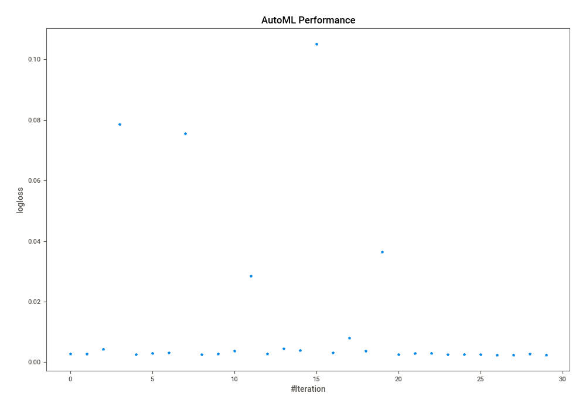
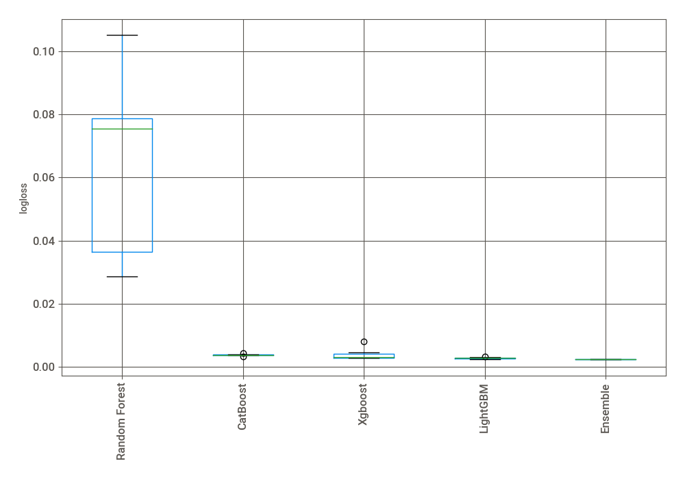
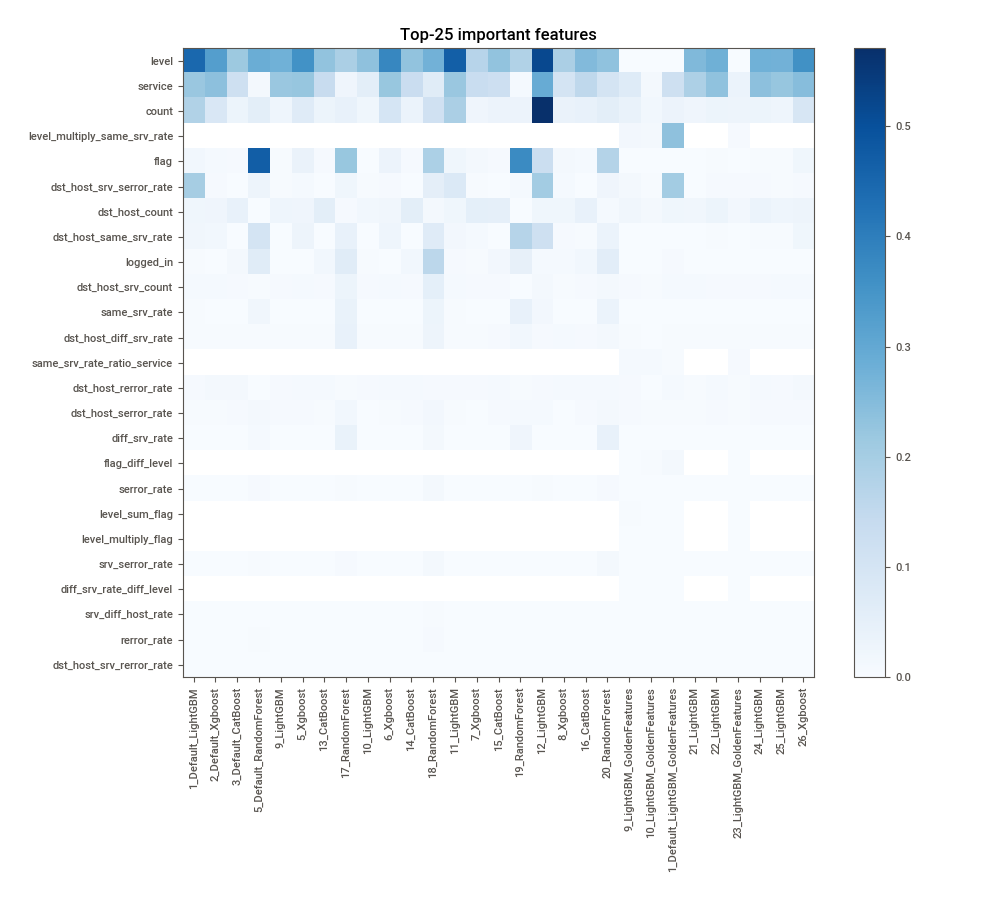
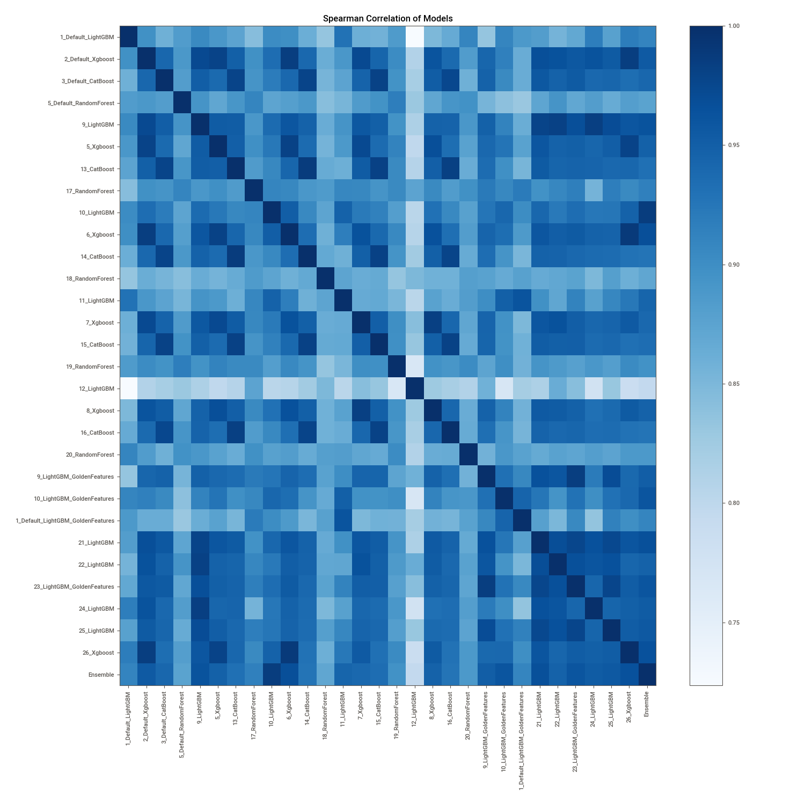

# AutoML Leaderboard

| Best model   | name                                                                             | model_type    | metric_type   |   metric_value |   train_time |   single_prediction_time |
|:-------------|:---------------------------------------------------------------------------------|:--------------|:--------------|---------------:|-------------:|-------------------------:|
|              | [1_Default_LightGBM](1_Default_LightGBM/README.md)                               | LightGBM      | logloss       |     0.00274489 |       188.59 |                   0.0288 |
|              | [2_Default_Xgboost](2_Default_Xgboost/README.md)                                 | Xgboost       | logloss       |     0.002792   |        52.58 |                   0.0275 |
|              | [3_Default_CatBoost](3_Default_CatBoost/README.md)                               | CatBoost      | logloss       |     0.00429244 |        34.14 |                   0.0349 |
|              | [5_Default_RandomForest](5_Default_RandomForest/README.md)                       | Random Forest | logloss       |     0.0786419  |        38.88 |                   0.0796 |
|              | [9_LightGBM](9_LightGBM/README.md)                                               | LightGBM      | logloss       |     0.00251889 |       233.79 |                   0.0295 |
|              | [5_Xgboost](5_Xgboost/README.md)                                                 | Xgboost       | logloss       |     0.00306027 |        72.56 |                   0.029  |
|              | [13_CatBoost](13_CatBoost/README.md)                                             | CatBoost      | logloss       |     0.00320673 |        95.54 |                   0.0351 |
|              | [17_RandomForest](17_RandomForest/README.md)                                     | Random Forest | logloss       |     0.0754331  |        27.44 |                   0.0867 |
|              | [10_LightGBM](10_LightGBM/README.md)                                             | LightGBM      | logloss       |     0.00268208 |       116.51 |                   0.0297 |
|              | [6_Xgboost](6_Xgboost/README.md)                                                 | Xgboost       | logloss       |     0.00277194 |        44.74 |                   0.0268 |
|              | [14_CatBoost](14_CatBoost/README.md)                                             | CatBoost      | logloss       |     0.0036945  |        45.26 |                   0.0378 |
|              | [18_RandomForest](18_RandomForest/README.md)                                     | Random Forest | logloss       |     0.028524   |        43.17 |                   0.0813 |
|              | [11_LightGBM](11_LightGBM/README.md)                                             | LightGBM      | logloss       |     0.00275957 |       216.42 |                   0.0292 |
|              | [7_Xgboost](7_Xgboost/README.md)                                                 | Xgboost       | logloss       |     0.00455847 |        74.78 |                   0.0297 |
|              | [15_CatBoost](15_CatBoost/README.md)                                             | CatBoost      | logloss       |     0.00387862 |        33.43 |                   0.0332 |
|              | [19_RandomForest](19_RandomForest/README.md)                                     | Random Forest | logloss       |     0.105103   |        46.28 |                   0.0998 |
|              | [12_LightGBM](12_LightGBM/README.md)                                             | LightGBM      | logloss       |     0.00324005 |       248.37 |                   0.0279 |
|              | [8_Xgboost](8_Xgboost/README.md)                                                 | Xgboost       | logloss       |     0.00809756 |        65.31 |                   0.0279 |
|              | [16_CatBoost](16_CatBoost/README.md)                                             | CatBoost      | logloss       |     0.00369694 |        30.13 |                   0.0341 |
|              | [20_RandomForest](20_RandomForest/README.md)                                     | Random Forest | logloss       |     0.0364414  |        28.67 |                   0.0768 |
|              | [9_LightGBM_GoldenFeatures](9_LightGBM_GoldenFeatures/README.md)                 | LightGBM      | logloss       |     0.00260382 |       258.25 |                   0.0456 |
|              | [10_LightGBM_GoldenFeatures](10_LightGBM_GoldenFeatures/README.md)               | LightGBM      | logloss       |     0.00291919 |       120    |                   0.0441 |
|              | [1_Default_LightGBM_GoldenFeatures](1_Default_LightGBM_GoldenFeatures/README.md) | LightGBM      | logloss       |     0.00298771 |       220.5  |                   0.0433 |
|              | [21_LightGBM](21_LightGBM/README.md)                                             | LightGBM      | logloss       |     0.00259538 |       362.37 |                   0.0284 |
|              | [22_LightGBM](22_LightGBM/README.md)                                             | LightGBM      | logloss       |     0.00251481 |       231.83 |                   0.03   |
|              | [23_LightGBM_GoldenFeatures](23_LightGBM_GoldenFeatures/README.md)               | LightGBM      | logloss       |     0.00269614 |       329.28 |                   0.0447 |
|              | [24_LightGBM](24_LightGBM/README.md)                                             | LightGBM      | logloss       |     0.00245531 |       129.65 |                   0.0292 |
|              | [25_LightGBM](25_LightGBM/README.md)                                             | LightGBM      | logloss       |     0.002446   |       137.14 |                   0.0287 |
|              | [26_Xgboost](26_Xgboost/README.md)                                               | Xgboost       | logloss       |     0.00275695 |        49.82 |                   0.0291 |
| **the best** | [Ensemble](Ensemble/README.md)                                                   | Ensemble      | logloss       |     0.00233978 |        30.14 |                   0.1258 |

### AutoML Performance

### AutoML Performance Boxplot

### Features Importance

### Spearman Correlation of Models

