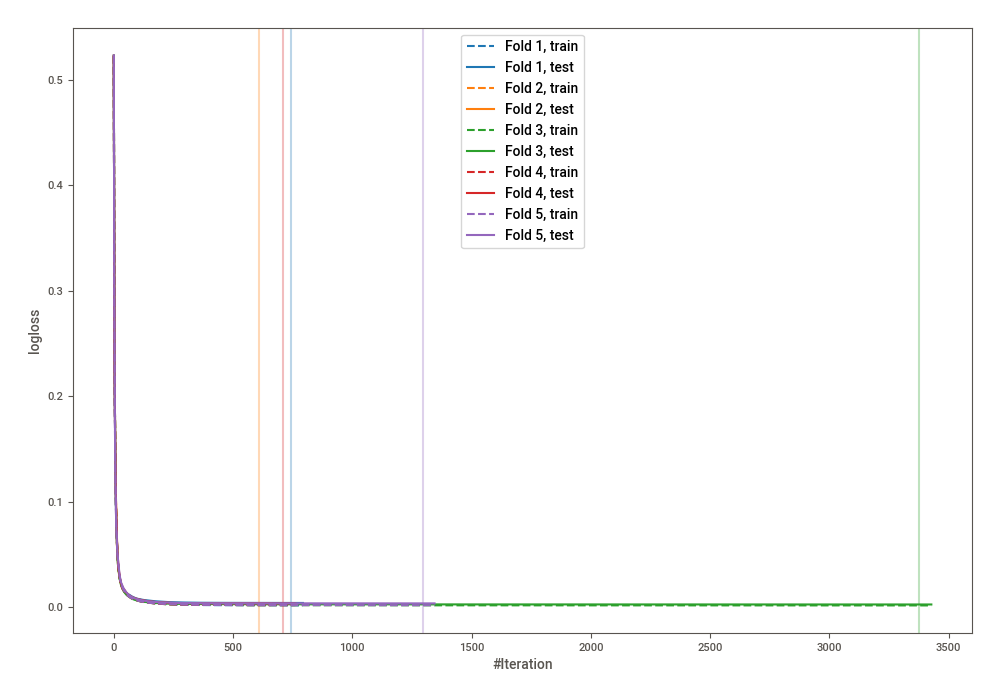
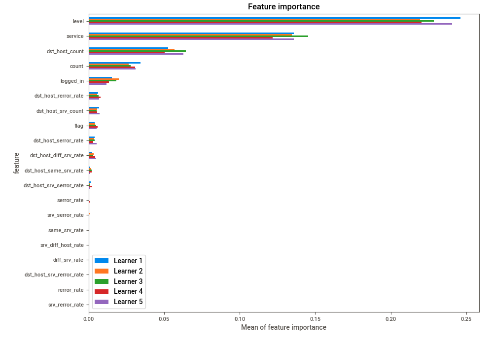
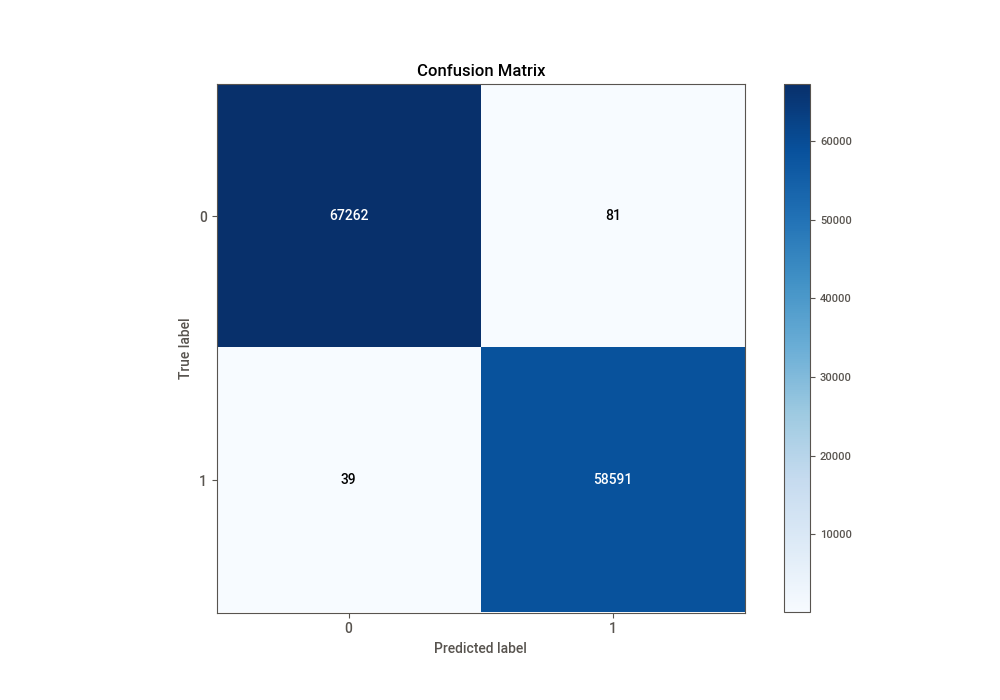
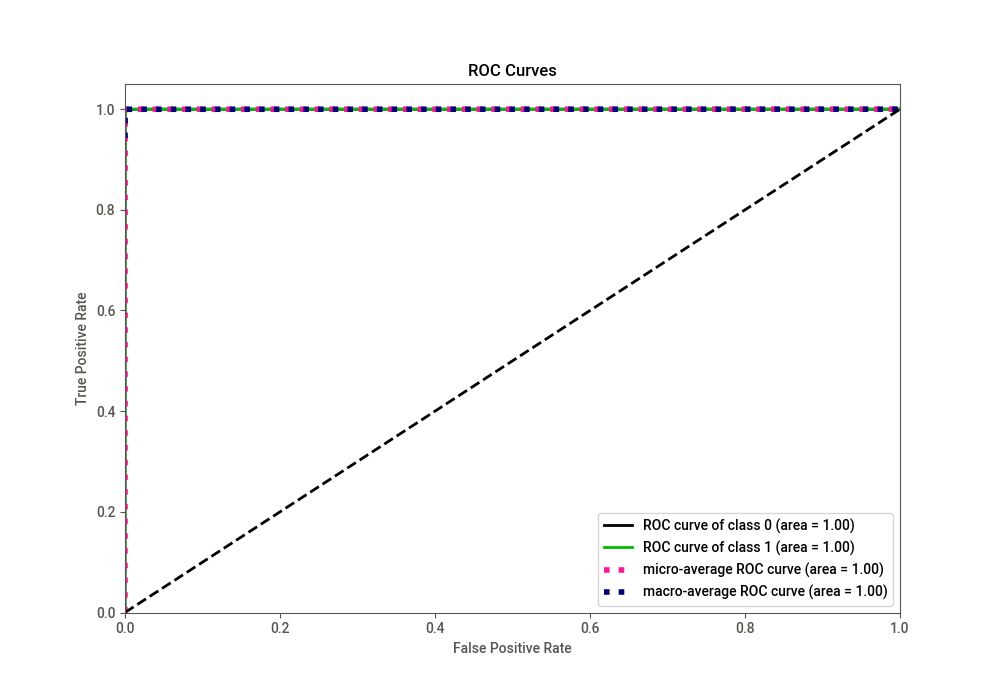
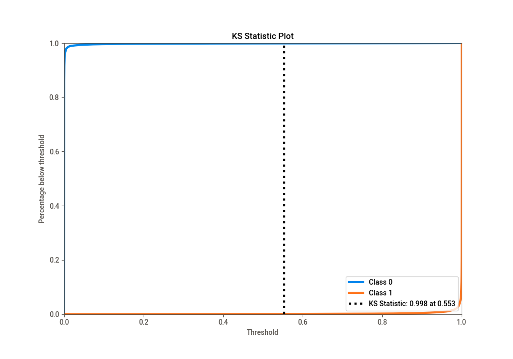
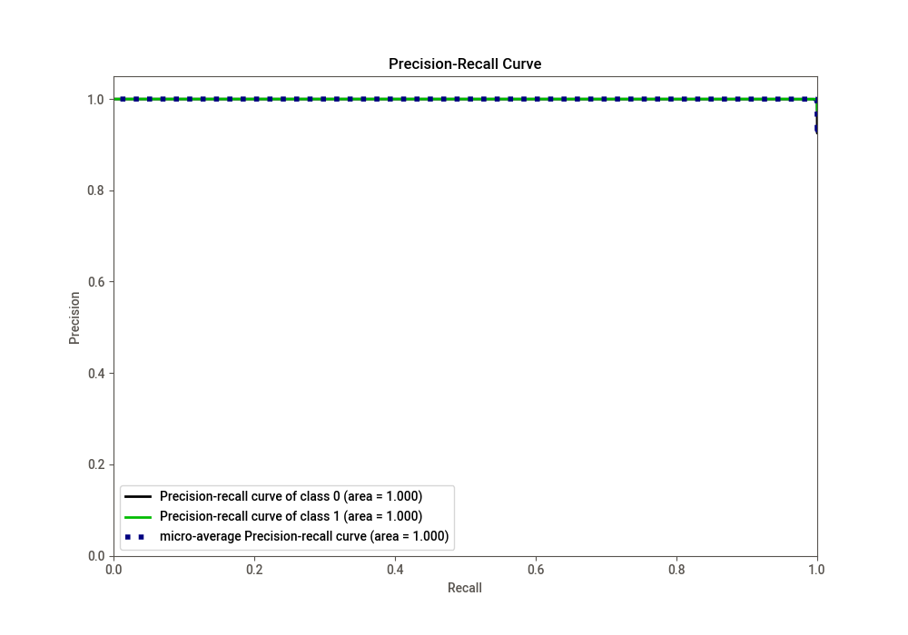
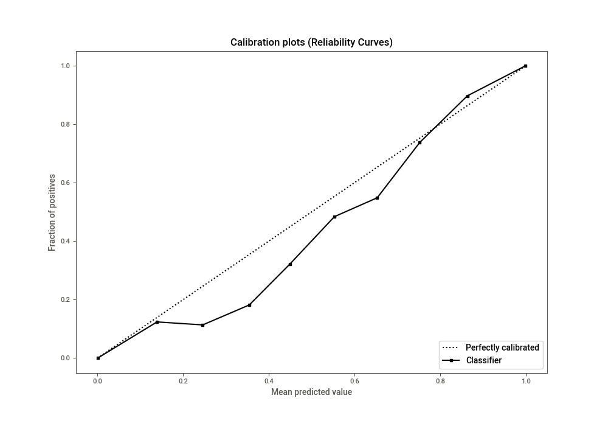
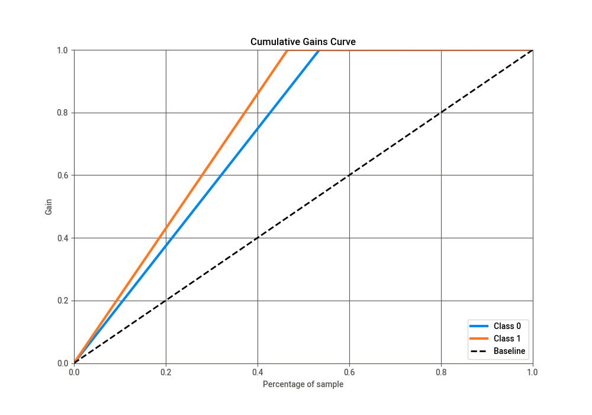
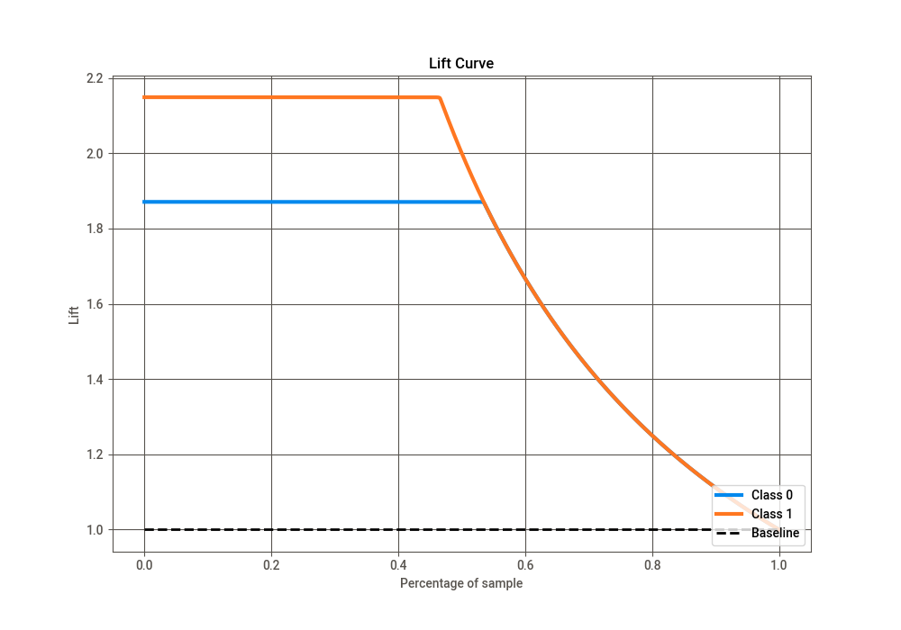

# Summary of 13_CatBoost

[<< Go back](../README.md)

## CatBoost
- **n_jobs**: -1
- **learning_rate**: 0.05
- **depth**: 8
- **rsm**: 0.8
- **loss_function**: Logloss
- **eval_metric**: Logloss
- **explain_level**: 1

## Validation
 - **validation_type**: kfold
 - **k_folds**: 5
 - **shuffle**: True
 - **stratify**: True

## Optimized metric
logloss

## Training time

118.4 seconds

## Metric details
|           |      score |     threshold |
|:----------|-----------:|--------------:|
| logloss   | 0.00320673 | nan           |
| auc       | 0.999992   | nan           |
| f1        | 0.998977   |   0.49506     |
| accuracy  | 0.999047   |   0.509159    |
| precision | 1          |   0.999732    |
| recall    | 1          |   1.27328e-07 |
| mcc       | 0.998086   |   0.49506     |

## Confusion matrix (at threshold=0.509159)
|              |   Predicted as 0 |   Predicted as 1 |
|:-------------|-----------------:|-----------------:|
| Labeled as 0 |            67262 |               81 |
| Labeled as 1 |               39 |            58591 |

## Learning curves

## Permutation-based Importance

## Confusion Matrix

## Normalized Confusion Matrix

## ROC Curve

## Kolmogorov-Smirnov Statistic

## Precision-Recall Curve

## Calibration Curve

## Cumulative Gains Curve

## Lift Curve

[<< Go back](../README.md)
