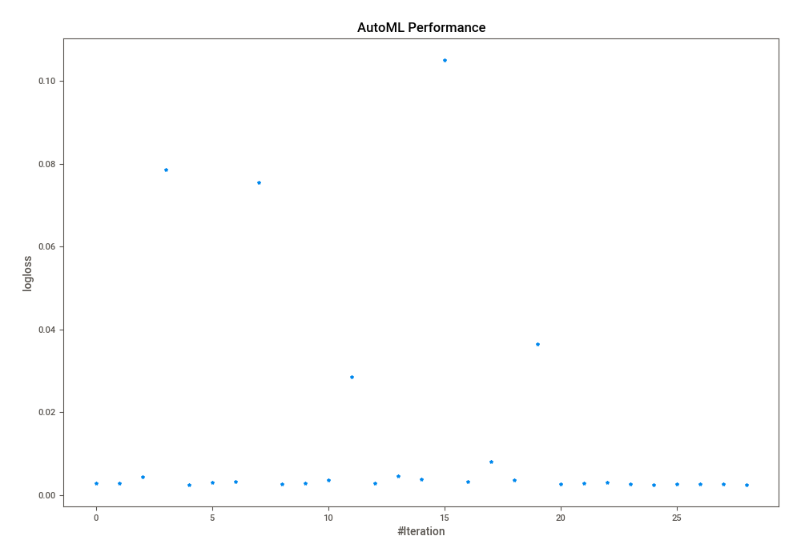
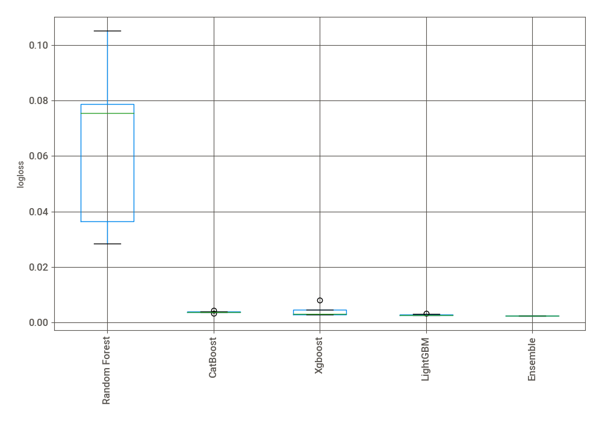
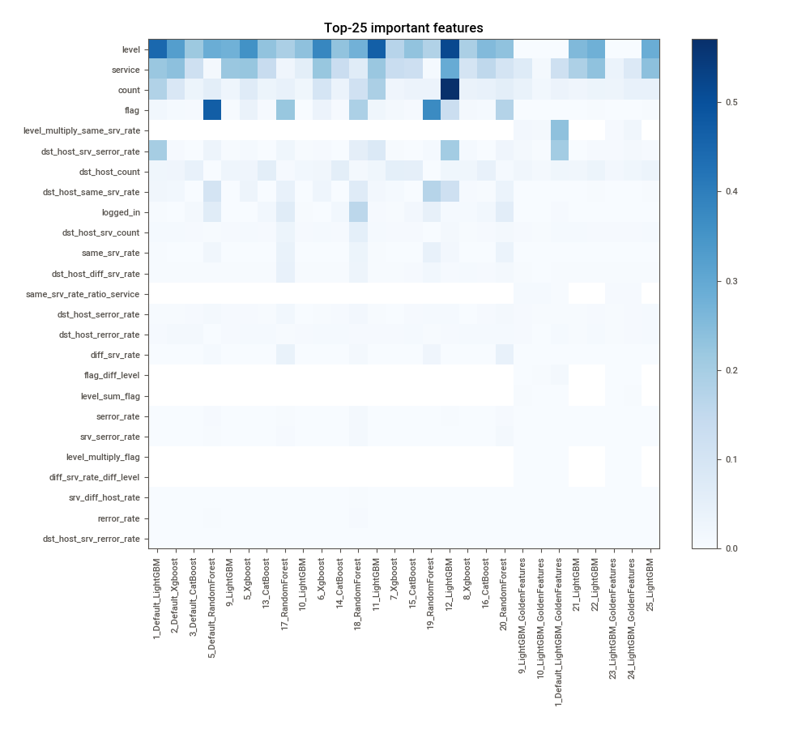
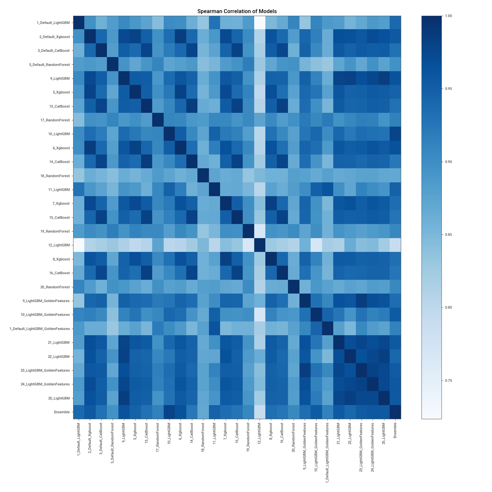

# AutoML Leaderboard

| Best model   | name                                                                             | model_type    | metric_type   |   metric_value |   train_time |   single_prediction_time |
|:-------------|:---------------------------------------------------------------------------------|:--------------|:--------------|---------------:|-------------:|-------------------------:|
|              | [1_Default_LightGBM](1_Default_LightGBM/README.md)                               | LightGBM      | logloss       |     0.00274489 |       137.28 |                   0.0309 |
|              | [2_Default_Xgboost](2_Default_Xgboost/README.md)                                 | Xgboost       | logloss       |     0.002792   |        89.63 |                   0.0396 |
|              | [3_Default_CatBoost](3_Default_CatBoost/README.md)                               | CatBoost      | logloss       |     0.00429244 |        44.94 |                   0.0353 |
|              | [5_Default_RandomForest](5_Default_RandomForest/README.md)                       | Random Forest | logloss       |     0.0786419  |        51.61 |                   0.0781 |
|              | [9_LightGBM](9_LightGBM/README.md)                                               | LightGBM      | logloss       |     0.00251887 |       231.78 |                   0.0315 |
|              | [5_Xgboost](5_Xgboost/README.md)                                                 | Xgboost       | logloss       |     0.00306027 |        97.49 |                   0.0323 |
|              | [13_CatBoost](13_CatBoost/README.md)                                             | CatBoost      | logloss       |     0.00320673 |       119.65 |                   0.0368 |
|              | [17_RandomForest](17_RandomForest/README.md)                                     | Random Forest | logloss       |     0.0754331  |        36.09 |                   0.087  |
|              | [10_LightGBM](10_LightGBM/README.md)                                             | LightGBM      | logloss       |     0.00268208 |        77.77 |                   0.0312 |
|              | [6_Xgboost](6_Xgboost/README.md)                                                 | Xgboost       | logloss       |     0.00277194 |        68.07 |                   0.0316 |
|              | [14_CatBoost](14_CatBoost/README.md)                                             | CatBoost      | logloss       |     0.0036945  |        55.49 |                   0.0357 |
|              | [18_RandomForest](18_RandomForest/README.md)                                     | Random Forest | logloss       |     0.028524   |        54.4  |                   0.0751 |
|              | [11_LightGBM](11_LightGBM/README.md)                                             | LightGBM      | logloss       |     0.00275957 |       141.75 |                   0.0302 |
|              | [7_Xgboost](7_Xgboost/README.md)                                                 | Xgboost       | logloss       |     0.00455847 |       119.89 |                   0.0297 |
|              | [15_CatBoost](15_CatBoost/README.md)                                             | CatBoost      | logloss       |     0.00387862 |        40.99 |                   0.0347 |
|              | [19_RandomForest](19_RandomForest/README.md)                                     | Random Forest | logloss       |     0.105103   |        57.26 |                   0.1135 |
|              | [12_LightGBM](12_LightGBM/README.md)                                             | LightGBM      | logloss       |     0.00324005 |       149.44 |                   0.0309 |
|              | [8_Xgboost](8_Xgboost/README.md)                                                 | Xgboost       | logloss       |     0.00809756 |       102.99 |                   0.0324 |
|              | [16_CatBoost](16_CatBoost/README.md)                                             | CatBoost      | logloss       |     0.00369694 |        37.06 |                   0.0348 |
|              | [20_RandomForest](20_RandomForest/README.md)                                     | Random Forest | logloss       |     0.0364414  |        36.36 |                   0.0695 |
|              | [9_LightGBM_GoldenFeatures](9_LightGBM_GoldenFeatures/README.md)                 | LightGBM      | logloss       |     0.0026037  |       270.61 |                   0.0488 |
|              | [10_LightGBM_GoldenFeatures](10_LightGBM_GoldenFeatures/README.md)               | LightGBM      | logloss       |     0.00291919 |        76.96 |                   0.0487 |
|              | [1_Default_LightGBM_GoldenFeatures](1_Default_LightGBM_GoldenFeatures/README.md) | LightGBM      | logloss       |     0.00298771 |       150.12 |                   0.0488 |
|              | [21_LightGBM](21_LightGBM/README.md)                                             | LightGBM      | logloss       |     0.00259538 |       362.53 |                   0.0306 |
|              | [22_LightGBM](22_LightGBM/README.md)                                             | LightGBM      | logloss       |     0.00251481 |       219.27 |                   0.0304 |
|              | [23_LightGBM_GoldenFeatures](23_LightGBM_GoldenFeatures/README.md)               | LightGBM      | logloss       |     0.00269601 |       333.44 |                   0.0493 |
|              | [24_LightGBM_GoldenFeatures](24_LightGBM_GoldenFeatures/README.md)               | LightGBM      | logloss       |     0.00258892 |       244.54 |                   0.049  |
|              | [25_LightGBM](25_LightGBM/README.md)                                             | LightGBM      | logloss       |     0.00256844 |       217.54 |                   0.0317 |
| **the best** | [Ensemble](Ensemble/README.md)                                                   | Ensemble      | logloss       |     0.0023847  |        34.69 |                   0.2201 |

### AutoML Performance

### AutoML Performance Boxplot

### Features Importance

### Spearman Correlation of Models

