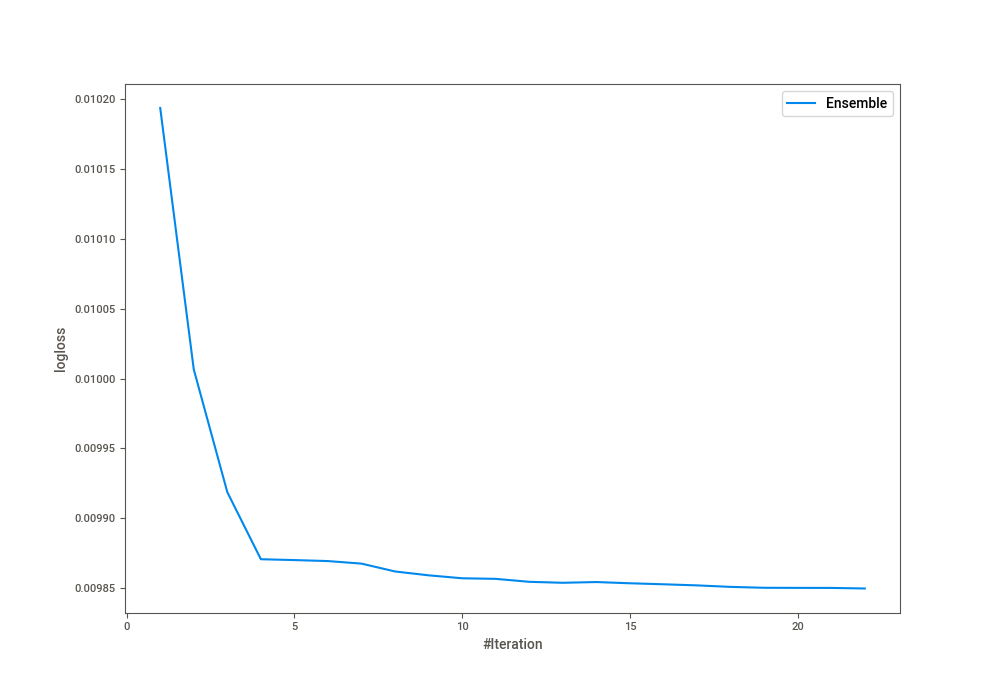
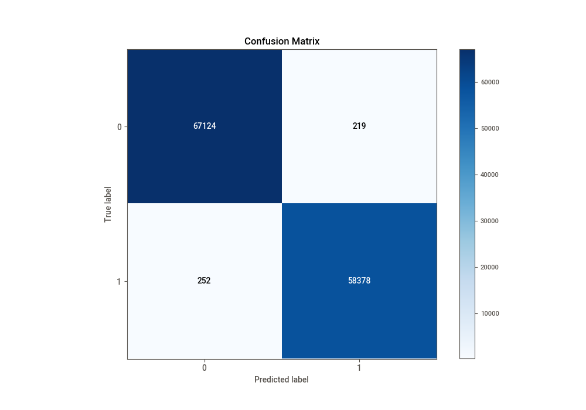
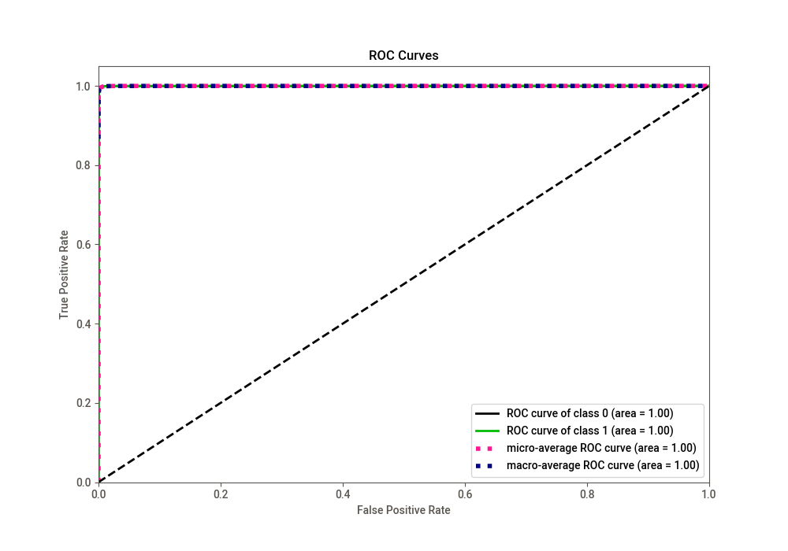
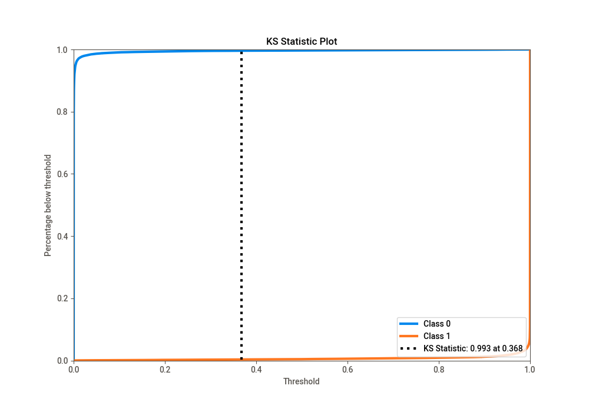
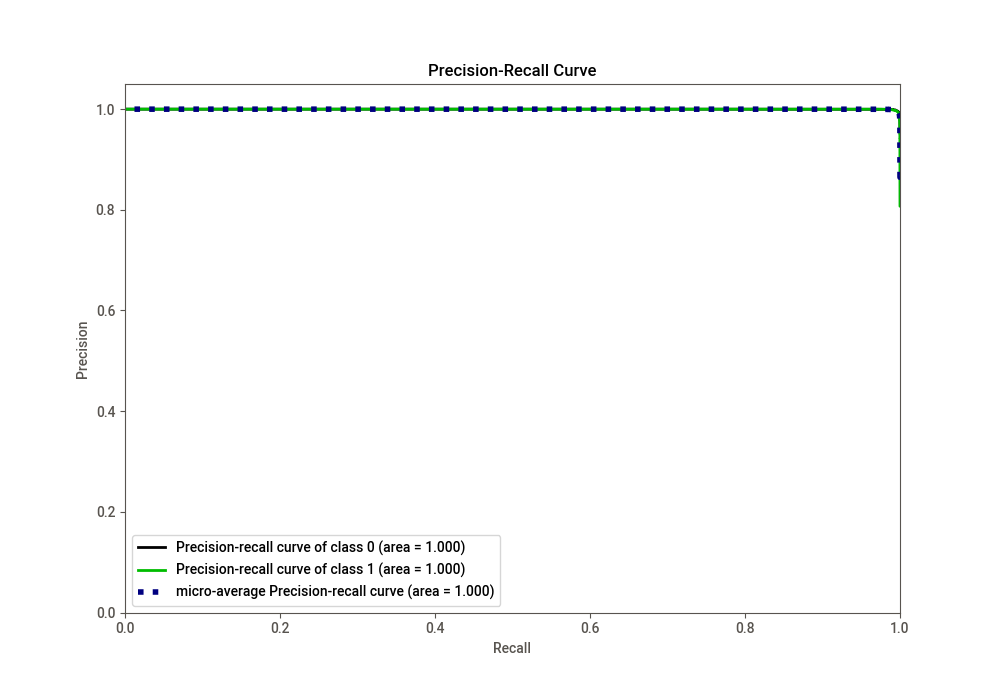
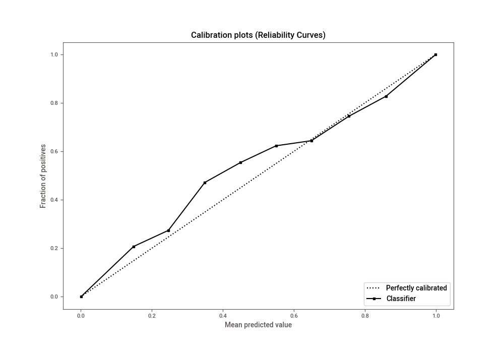
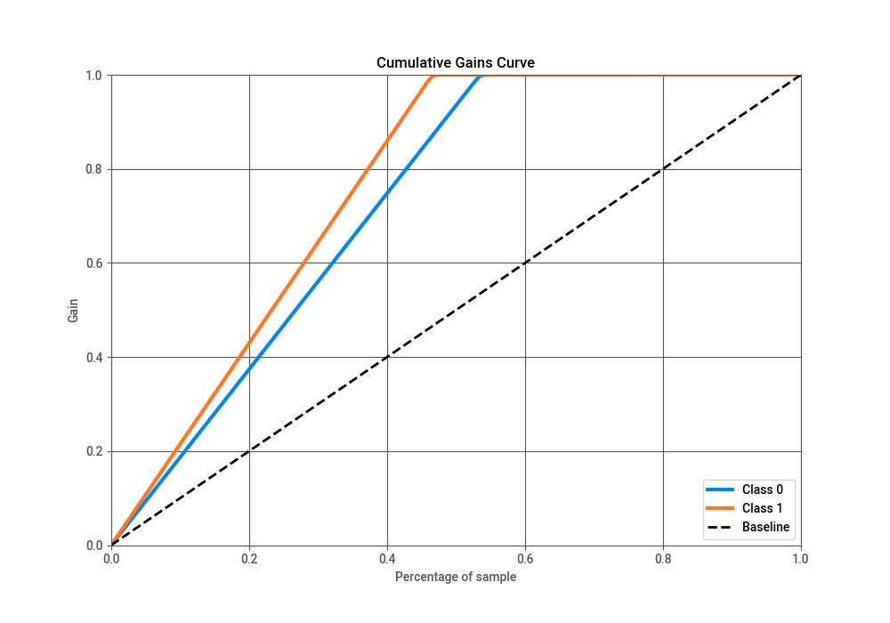
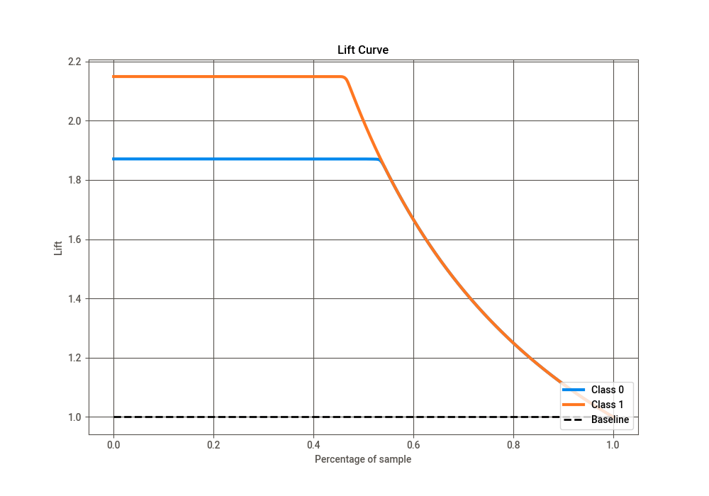

# Summary of Ensemble

[<< Go back](../README.md)

## Ensemble structure
| Model                             |   Weight |
|:----------------------------------|---------:|
| 10_LightGBM                       |        1 |
| 13_CatBoost                       |        1 |
| 1_Default_LightGBM                |        2 |
| 1_Default_LightGBM_GoldenFeatures |        5 |
| 20_LightGBM                       |        3 |
| 21_LightGBM                       |        2 |
| 6_Xgboost                         |        5 |
| 9_LightGBM                        |        3 |

## Metric details
|           |      score |     threshold |
|:----------|-----------:|--------------:|
| logloss   | 0.00984979 | nan           |
| auc       | 0.99993    | nan           |
| f1        | 0.995983   |   0.477254    |
| accuracy  | 0.996261   |   0.500968    |
| precision | 1          |   0.999956    |
| recall    | 1          |   4.40442e-07 |
| mcc       | 0.992486   |   0.477254    |

## Confusion matrix (at threshold=0.500968)
|              |   Predicted as 0 |   Predicted as 1 |
|:-------------|-----------------:|-----------------:|
| Labeled as 0 |            67124 |              219 |
| Labeled as 1 |              252 |            58378 |

## Learning curves

## Confusion Matrix

## Normalized Confusion Matrix

## ROC Curve

## Kolmogorov-Smirnov Statistic

## Precision-Recall Curve

## Calibration Curve

## Cumulative Gains Curve

## Lift Curve

[<< Go back](../README.md)
