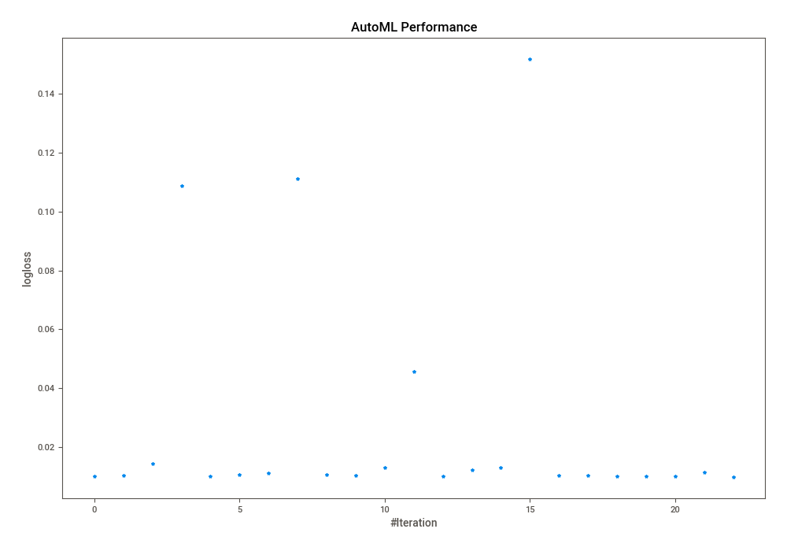
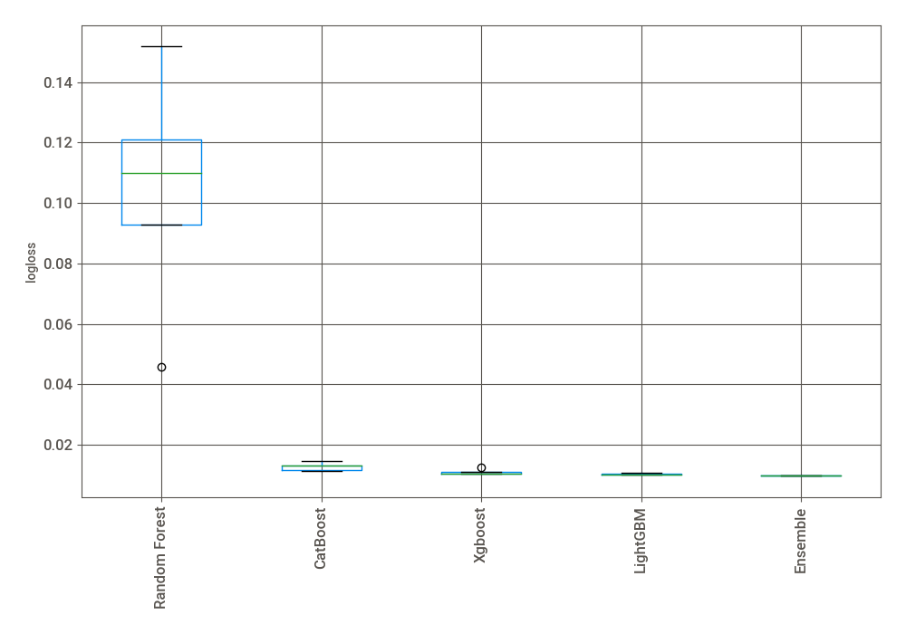
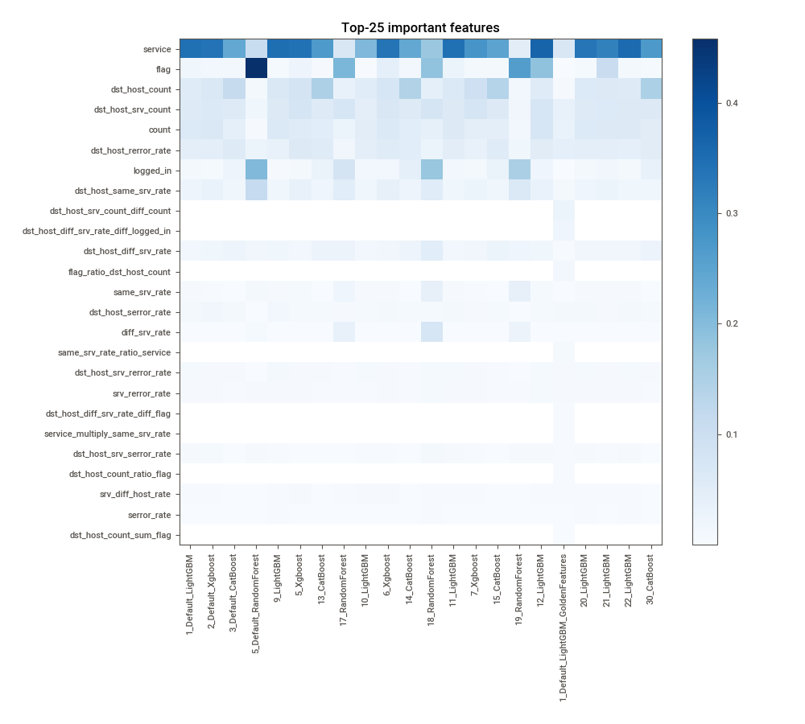
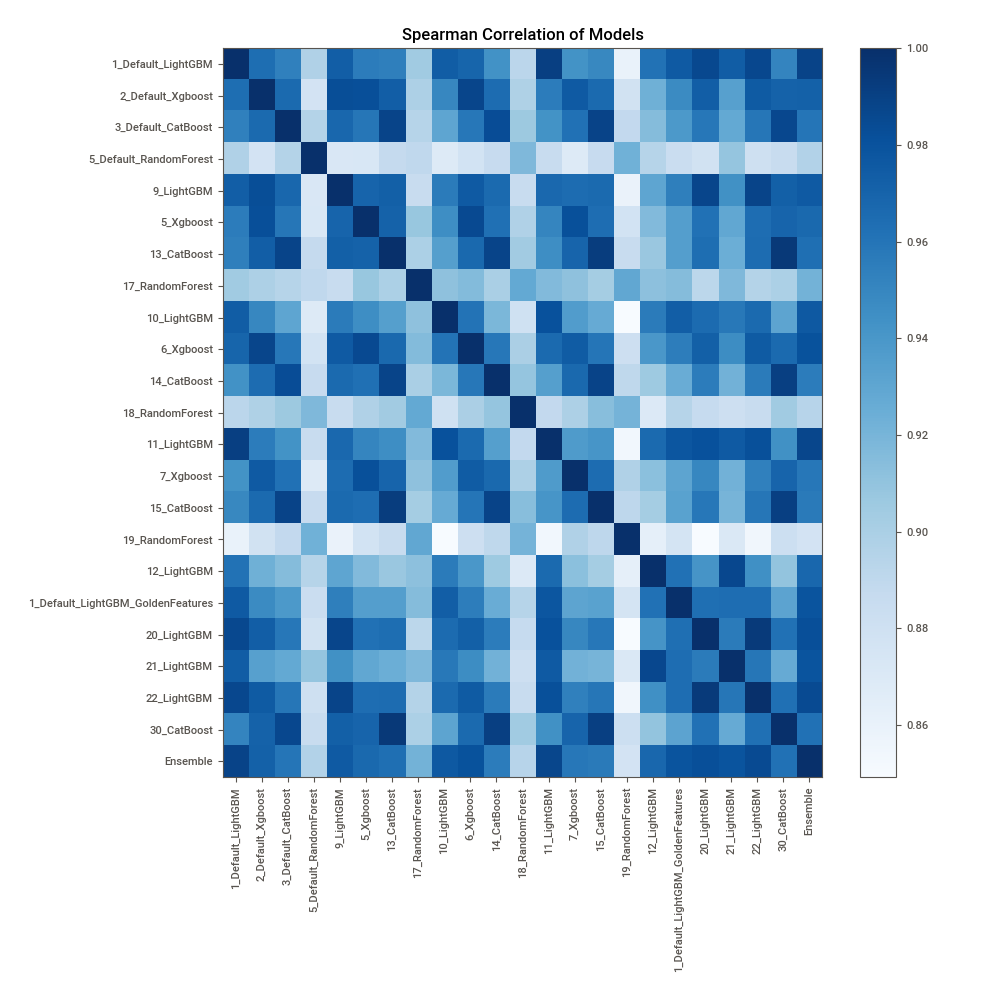

# AutoML Leaderboard

| Best model   | name                                                                             | model_type    | metric_type   |   metric_value |   train_time |   single_prediction_time |
|:-------------|:---------------------------------------------------------------------------------|:--------------|:--------------|---------------:|-------------:|-------------------------:|
|              | [1_Default_LightGBM](1_Default_LightGBM/README.md)                               | LightGBM      | logloss       |     0.0101937  |       224.34 |                   0.0292 |
|              | [2_Default_Xgboost](2_Default_Xgboost/README.md)                                 | Xgboost       | logloss       |     0.0104997  |       103.78 |                   0.0283 |
|              | [3_Default_CatBoost](3_Default_CatBoost/README.md)                               | CatBoost      | logloss       |     0.0146058  |        50.39 |                   0.0339 |
|              | [5_Default_RandomForest](5_Default_RandomForest/README.md)                       | Random Forest | logloss       |     0.108644   |        70.76 |                   0.0979 |
|              | [9_LightGBM](9_LightGBM/README.md)                                               | LightGBM      | logloss       |     0.010247   |       533.83 |                   0.0307 |
|              | [5_Xgboost](5_Xgboost/README.md)                                                 | Xgboost       | logloss       |     0.0107297  |       148.94 |                   0.0295 |
|              | [13_CatBoost](13_CatBoost/README.md)                                             | CatBoost      | logloss       |     0.011266   |       109.1  |                   0.0338 |
|              | [17_RandomForest](17_RandomForest/README.md)                                     | Random Forest | logloss       |     0.110989   |        49.76 |                   0.0695 |
|              | [10_LightGBM](10_LightGBM/README.md)                                             | LightGBM      | logloss       |     0.0107163  |       106.7  |                   0.0283 |
|              | [6_Xgboost](6_Xgboost/README.md)                                                 | Xgboost       | logloss       |     0.0103619  |       107.57 |                   0.0304 |
|              | [14_CatBoost](14_CatBoost/README.md)                                             | CatBoost      | logloss       |     0.0132567  |        51.75 |                   0.0341 |
|              | [18_RandomForest](18_RandomForest/README.md)                                     | Random Forest | logloss       |     0.045813   |        80.25 |                   0.0881 |
|              | [11_LightGBM](11_LightGBM/README.md)                                             | LightGBM      | logloss       |     0.0102048  |       227.81 |                   0.0306 |
|              | [7_Xgboost](7_Xgboost/README.md)                                                 | Xgboost       | logloss       |     0.0124527  |       227.94 |                   0.0322 |
|              | [15_CatBoost](15_CatBoost/README.md)                                             | CatBoost      | logloss       |     0.0131537  |        56.07 |                   0.0343 |
|              | [19_RandomForest](19_RandomForest/README.md)                                     | Random Forest | logloss       |     0.151761   |        65.57 |                   0.1069 |
|              | [12_LightGBM](12_LightGBM/README.md)                                             | LightGBM      | logloss       |     0.0104667  |       203.1  |                   0.0309 |
|              | [1_Default_LightGBM_GoldenFeatures](1_Default_LightGBM_GoldenFeatures/README.md) | LightGBM      | logloss       |     0.0104605  |       250.26 |                   0.0505 |
|              | [20_LightGBM](20_LightGBM/README.md)                                             | LightGBM      | logloss       |     0.010249   |       307.14 |                   0.0304 |
|              | [21_LightGBM](21_LightGBM/README.md)                                             | LightGBM      | logloss       |     0.0102397  |       206.73 |                   0.0299 |
|              | [22_LightGBM](22_LightGBM/README.md)                                             | LightGBM      | logloss       |     0.0102418  |       294.52 |                   0.0305 |
|              | [30_CatBoost](30_CatBoost/README.md)                                             | CatBoost      | logloss       |     0.0115712  |       111.74 |                   0.0363 |
| **the best** | [Ensemble](Ensemble/README.md)                                                   | Ensemble      | logloss       |     0.00984979 |        28.59 |                   0.2612 |

### AutoML Performance

### AutoML Performance Boxplot

### Features Importance

### Spearman Correlation of Models

